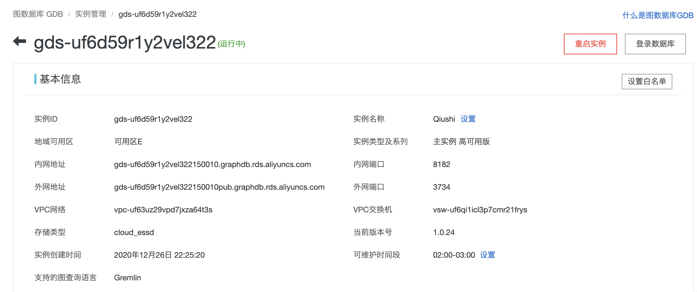
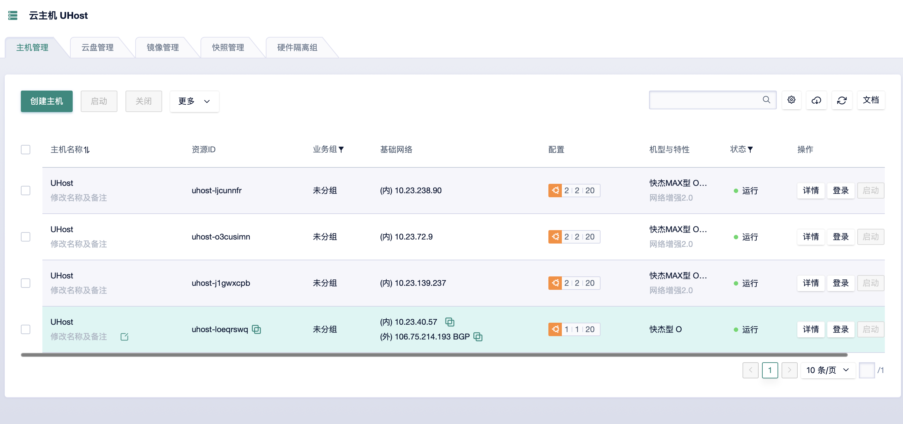
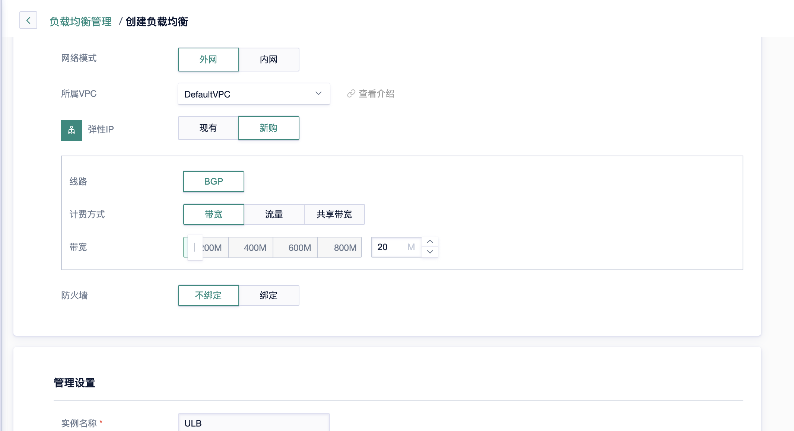
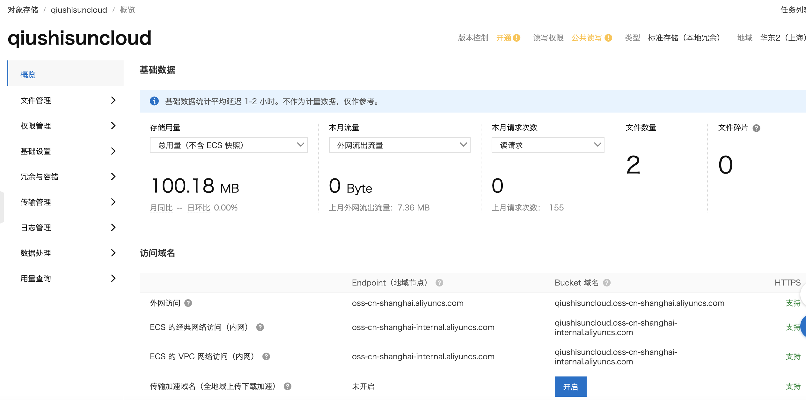
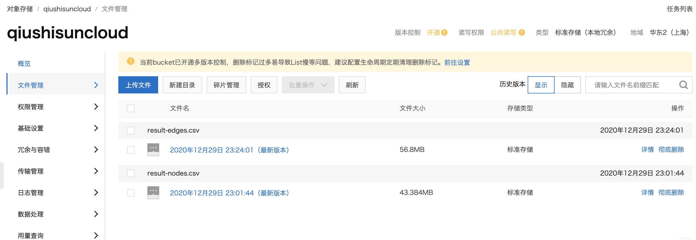
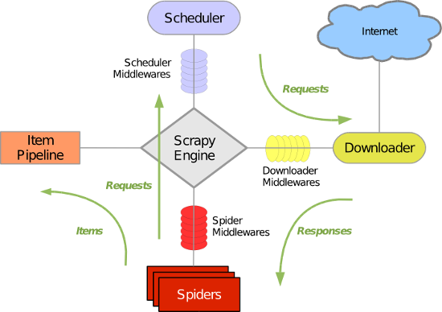
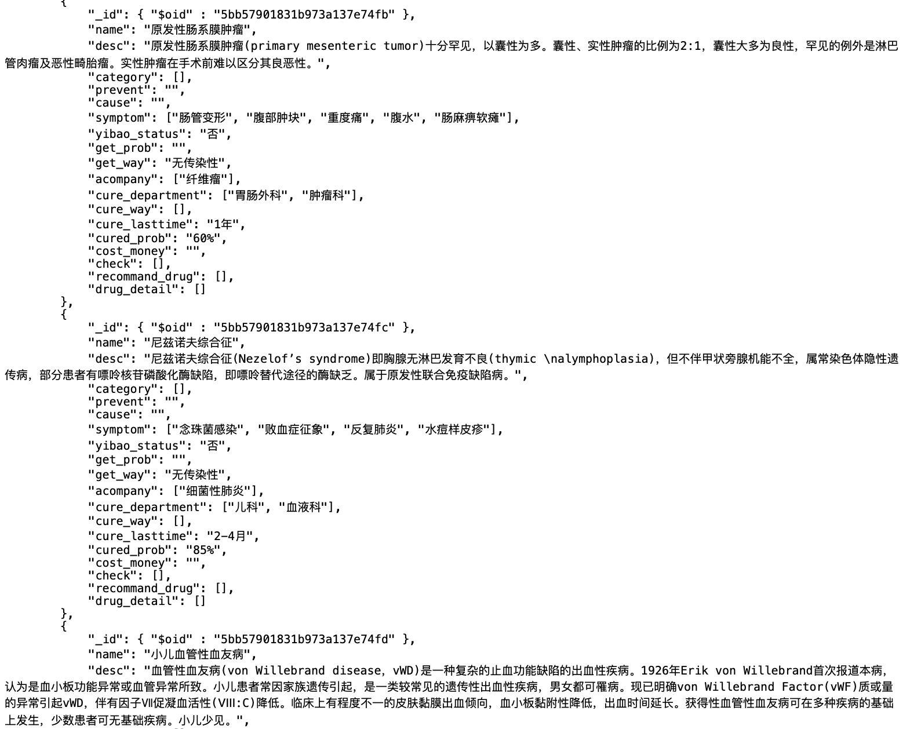
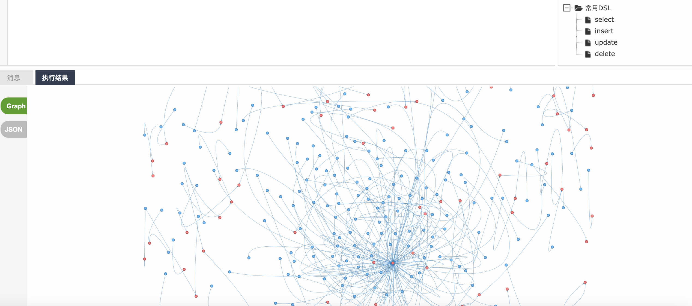
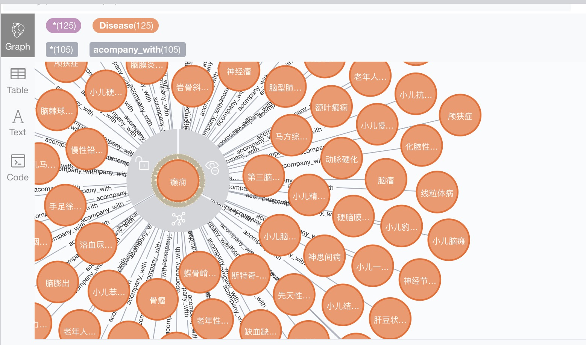
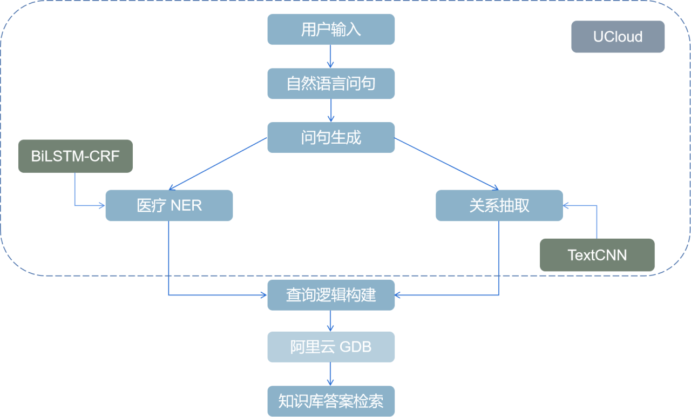

# Chatbot4MedicalAdvices

## 云计算应用与开发 2020 Fall

### 课程期末大项目

| 课程：云计算应用与开发 | 项目名称：Chatbot4MedicalAdvices |
| ---------------------- | -------------------------------- |
| **姓名：孙秋实**       | **学号：10185501402**            |
| **姓名：孙印政**       | **学号：10185501404**            |
| **姓名：汤琼**         | **学号：10182100106**            |

本小组基于深度学习方法，解析医疗领域相关问题，并实现了包括数据采集、知识图谱存储（云数据库）、知识查询、问答系统构建的医疗领域智能问答系统。

#### 项目演示视频为目录下的Demo.mp4

## 一. 项目介绍

​		本项目通过使用名为 Scrapy 的爬虫框架进行数据采集、阿里云图数据库存储知识图谱及使用深度学习方法解析问题，以此构造了一个中文的医疗领域问答系统，以便人们可以通过聊天的方式快速、精准地获取到指定疾病的介绍、治疗方法、用药方案等信息，系统将具有一定的理解人类语言的能力，具有可重用性，并且与知识图谱建立联系，根据问题动态地获取数据、构造答案、返回答案。

​		具体实现内容如下

- 爬取垂直网站数据并进行清洗
- 基于垂直网站数据的医药知识图谱构建，并将本地neo4j数据库迁移到阿里云图数据库GDB
- 基于医药知识图谱的自动问答
- 基于Flask框架实现自动问答可视化

## 二. 项目应用效果

SaaS应用效果截图：


## 三. 服务上云和运行方式

## 云服务

#### **First things first: 由于云图数据库的连接需要将本地ip添加至阿里云图数据库白名单**

#### 项目演示视频为目录下的Demo.mp4

### 1.阿里云图数据库GDB（Graph Database）

#### 1.1简介：GDB是一种支持属性图模型，用于处理高度连接数据查询与存储的实时可靠的在线数据库，支持Gremlin 查询语言。GDB具备以下几个特点：

- 开放图查询语言：支持属性图模型，高度兼容Gremlin图查询语言
- 服务高可用：支持高可用实例，节点故障迅速转移，保障业务连续性
- 高度优化的自研引擎：高度优化的自研图计算层和存储层，云盘多副本保障数据超高可靠，支持ACID事务
- 易运维：提供备份恢复，自动升级，监控告警，故障切换等丰富的运维功能，大幅降低运维成本

#### 1.2创建图数据库

##### 图数据库规格：

- 2核16G

- 节点数：2

- 内核版本：Gremlin

- 存储类型：ESSD云盘     (***块存储***）

  ​    ESSD云盘适用于时延敏感的应用或者I/O密集型业务场景：

  - 大型OLTP（Online Transaction Processing）数据库：如MySQL、PostgreSQL、Oracle、SQL Server等关系型数据库
  - NoSQL数据库：如MongoDB、HBase、Cassandra等非关系型数据库

- 创建专用VPC网络以及VPC交换机

- 时长：3个月



### 2.Ucloud云主机

#### 2.1单台UHost配置：

- CPU：AMD 2核
- 系统：Ubuntu 20.04 64位
- 内存： 4G
- 磁盘： RSSD云盘 20G
- 绑定外网弹性IP：选择流量计费：带宽为50MB


#### 2.2配置多台云主机作为ULB负载均衡服务节点,从而减轻单点服务器的压力。



### 3.实现负载均衡架构

#### 3.1负载均衡简介

- 将负载（工作任务，访问请求）进行平衡、分摊到多个操作单元（服务器，组件）上进行执行。是解决高性能，单点故障（高可用），扩展性（水平伸缩）的终极解决方案

  

#### 3.2负载均衡的作用

- 解决并发压力，提高应用处理性能（增加吞吐量，加强网络处理能力）；

- 提供故障转移，实现高可用；
- 通过添加或减少服务器数量，提供网站伸缩性（扩展性）；

- 安全防护（负载均衡设备上做一些过滤，黑白名单等处理）；

#### 3.3创建负载均衡器（ULB）

##### ULB配置：

- 网络模式为外网访问
- 线路为BGP
- 带宽设置为20M



### 4.实现对象数据管理

我们使用OSS(Object Storage Services)管理对象形式存储的数据





## 四. 数据采集与数据处理

本项目爬虫实现是使用了 scrapy 库，若想运行，可以运行 `SpiderMain.py`

### 4.1 Scrapy

Scrapy 是一套基于 Twisted 的异步处理框架，是纯 Python 实现的爬虫框架，用户只需要定制开发几个模块就可以轻松实现一个爬虫，用来抓取网页中的内容、图片等。通常单次爬取行为可分如下步骤：引擎（Engine）的作用是控制事件的触发和数据在组件中的流动，引擎根据 URL 构造请求（Request）对象传递给调度器（Scheduler），调度器将请求对象进行排队，引擎需要时，调度器就把请求数据给引擎，由引擎交给下载器（Downloader）并由下载器获取对应的响应数据（Response）交还给引擎，引擎把响应数据交给爬虫（Spider）进行解析提取，提取到的数据产生出对应的项目（Item）交给管道（Item Pipeline）进行后期过滤或者存储等。 



### 4.2 数据采集

考虑到目标是要做一个中文的医疗方面的问答系统，所以需要去搜集疾病、药物等有关的数据，但是搜寻一番后发现并没有符合需求的开放数据集，所以使用 Scrapy 库来编写爬虫程序爬取了寻医问药网等垂直医疗网站。

```python
class MedicalSpider(scrapy.Spider):
    name = "medical"
    allowed_domains = ["jib.xywy.com"]
    # start_urls = [
    # http: // jib.xywy.com / il_sii_10136.htm
    # "http://jib.xywy.com/il_sii/gaishu/10136.htm",
    # "http://jib.xywy.com/il_sii/cause/10136.htm",
    # "http://jib.xywy.com/il_sii/prevent/10136.htm",
    # "http://jib.xywy.com/il_sii/neopathy/10136.htm",  # ------------No
    # "http://jib.xywy.com/il_sii/symptom/10136.htm",
    # "http://jib.xywy.com/il_sii/inspect/10136.htm",   # ------------No
    # "http://jib.xywy.com/il_sii/diagnosis/10136.htm", # ------------No
    # "http://jib.xywy.com/il_sii/treat/10136.htm",
    # "http://jib.xywy.com/il_sii/nursing/10136.htm",
    # "http://jib.xywy.com/il_sii/food/10136.htm"
    # "http://jib.xywy.com/il_sii/drug/10136.htm"
    # ]    # 1-10136
    custom_settings = {
        "ITEM_PIPELINES": {
            'MedicalSpider.pipelines.MedicalSpiderPipeline': 500,
        },
    }
    numbers = read_numbers(start, end)    # ['6978'] missing finally  # 参数是行数起止，并非数字起止
    failures = dict()
```

### 4.3 合并数据与数据预处理

由于数据是分布式爬取的，需要合并，主要通过 merge 函数实现。该函数在获取疾病字典数据后，进行去重、排序等处理，以 JSON 格式写入文件。

同时，从不同垂直网站爬取的数据格式与导入数据库格式不一致，我们需要进行清洗脏整理、整理数据格式存并设计数据入库的结构。

```python
def merge(diseases: dict):
    set_dis = set()
    print('Original diseases: %d' % len(diseases))
    f = open(datadir + 'medical.json', 'a', encoding='UTF-8')
    for disease in diseases:
        disease['cure_dept'] = [dept + '科' for dept in disease['cure_dept'].split('科') if dept]
        if disease.get('treat'):
            disease['treat'] = [treat for treat in disease['treat'].split(' ') if treat]
        else:
            disease['treat'] = []
        disease = json.dumps(disease, ensure_ascii=False)
        set_dis.add(disease)
    set_dis = list(set_dis)
    sort_set_dis = sorted(set_dis, key=lambda x: int(json.loads(x)['id']))
    print('Set diseases: %d' % len(sort_set_dis))
    # print('Total words count %d' % len())
    # f.writelines(sort_set_dis)
    for disease in sort_set_dis:
        f.write(disease + '\n')
    f.close()
```


### 4.4 数据一览




### 4.5 将本地数据库Neo4j数据转移到阿里云GDB

 #### 4.5.1 requirements

⼀台本地图数据库服务器（如neo4j）

⼀台云图数据库（阿里云GDB）

#### 4.5.2 导入过程

1. 进行 cypher-shell 写入语句测试，确保数据库可用，操作示范如下

   ```
   # 写⼊点数据
   create (:person {id:"1", name:"marko", age:29});
   create (:person {id:"2", name:"vadas", age:27});
   create (:person {id:"3", name:"lop", lang:"java"});
   create (:person {id:"4", name:"josh", age:32});
   create (:person {id:"5", name:"ripple", lang:"java"});
   create (:person {id:"6", name:"peter", age:35});
   
   # 写⼊边数据
   start n=node(*), m=node(*) where n.id="6" and m.id="3"
   create (n)-[:created {id:"12", weight:0.2}]->(m);
   start n=node(*), m=node(*) where n.id="4" and m.id="3"
   create (n)-[:created {id:"11", weight:0.4}]->(m);
   start n=node(*), m=node(*) where n.id="4" and m.id="5"
   create (n)-[:created {id:"10", weight:1.0}]->(m);
   start n=node(*), m=node(*) where n.id="1" and m.id="3"
   create (n)-[:created {id:"9", weight:0.4}]->(m);
   start n=node(*), m=node(*) where n.id="1" and m.id="4"
   create (n)-[:knowns {id:"8", weight:1.0}]->(m);
   start n=node(*), m=node(*) where n.id="1" and m.id="2"
   create (n)-[:knowns {id:"7", weight:0.5}]->(m);
   ```

   2.使用 neo4j 数据库插件 apoc 来导出云服务器中的数据

   3.阿里云GDB目前不支持导入 graphml 格式文件数据，可以使用下面工具转换 graphml 格式到 GDB 支持的 Gremlin(CSV) 格式。

   4.转换成功后有节点属性和边属性，如下所示

   ```
   # CSV点数据⽂件
    $ cat result-nodes.csv
    ~id,~label,name:string,id:string,lang:string,age:long
   0,person,marko,1,,29
   1,person,josh,4,,32
   2,person,ripple,5,java,
   3,person,peter,6,,35
   20,person,vadas,2,,27
   21,person,lop,3,java,
   # CSV边数据⽂件
    $ cat result-edges.csv
   ~id,~from,~to,~label,weight:double,id:string
   0,3,21,created,0.2,12
   20,1,21,created,0.4,11
   21,1,2,created,1,10
   22,0,21,created,0.4,9
   23,0,1,knowns,1,8
   40,0,20,knowns,0.5,7
   ```

   处理数据需要使用GDB工具包，附在src中

   上述转换后得到点和边两个csv数据文件，我们使用GDB导入工具发送导入命令完成数据导入。（也可以使用curl访问）

   如果使用DMS的OSS系统，那么上传转换后的点、边 CSV 文件到 OSS bucket。注意检查bucket的地域和GDB实例是否相同，如果不⼀致，可以申请新的相同地域bucket。以下使用OSS命令行工具ossutil上传数据到OSS，请替换您的bucket名称。

   ```
   #点⽂件
   ./ossutil cp result-nodes.csv oss://${mybucket}/neo4jdata/result-nodes.csv
   #边⽂件
   ./ossutil cp result-edges.csv oss://${mybucket}/neo4jdata/result-edges.csv
   ```

   使用GDB工具导入如下所示

   ```
   # 添加导⼊点任务
   python GdbLoader.py --host ${mygdb-endpoint}:8182 --
   username ${username} --password ${password} --todo 
   add_task --source oss://{mybucket}/neo4j-data/resultnodes.csv --arn acs:ram::${my-uid}:role/${role-name}
   # 添加导⼊边任务
   python GdbLoader.py --host ${mygdb-endpoint}:8182 --
   username ${username} --password ${password} --todo 
   add_task --source oss://${mybucket}/neo4j-data/resultedges.csv --arn acs:ram::${my-uid}:role/${role-name}
   # 查询任务详情
   python GdbLoader.py --host ${mygdb-endpoint}:8182 --
   username ${username} --password ${password} --todo 
   get_task --loaderId 552617AF-4F1E-4CD8-9533-
   A2EC154688DC
   ```

   

#### 4.5.3 云数据库展示（试试Gremlin g.V()/g.E()）



## 五. 医疗知识图谱

### 5.1 图数据库一览（和本地相对应）


### 5.2 知识图谱一览




### 5.2 知识图谱实体类型

| 实体类型   |   中文含义   | 实体数量 | 举例                                   |
| :--------- | :----------: | :------: | :------------------------------------- |
| Check      | 诊断检查项目 |  3,783   | 支气管造影;关节镜检查                  |
| Department |   医疗科目   |   168    | 整形美容科;烧伤科                      |
| Disease    |     疾病     |  15,509  | 血栓闭塞性脉管炎;胸降主动脉动脉瘤      |
| Drug       |     药品     |  5,683   | 京万红痔疮膏;布林佐胺滴眼液            |
| Food       |     食物     |  8,719   | 番茄冲菜牛肉丸汤;竹笋炖羊肉            |
| Producer   |   在售药品   |  19,691  | 通药制药青霉素V钾片;青阳醋酸地塞米松片 |
| Symptom    |   疾病症状   |  8,175   | 乳腺组织肥厚;脑实质深部出血            |
| Total      |     总计     |  61,728  | 约4.4万实体量级                        |

### 5.3 知识图谱实体关系类型

| 实体关系类型   |   中文含义   | 关系数量 | 举例                                                 |
| :------------- | :----------: | :------: | :--------------------------------------------------- |
| belongs_to     |     属于     |  12,844  | <妇科,属于,妇产科>                                   |
| common_drug    | 疾病常用药品 |  76,649  | <阳强,常用,甲磺酸酚妥拉明分散片>                     |
| do_eat         | 疾病宜吃食物 |  96,238  | <胸椎骨折,宜吃,黑鱼>                                 |
| drugs_of       | 药品在售药品 |  65,315  | <青霉素V钾片,在售,通药制药青霉素V钾片>               |
| need_check     | 疾病所需检查 |  61,962  | <单侧肺气肿,所需检查,支气管造影>                     |
| no_eat         | 疾病忌吃食物 |  86,247  | <唇病,忌吃,杏仁>                                     |
| recommand_drug | 疾病推荐药品 |  91,467  | <混合痔,推荐用药,京万红痔疮膏>                       |
| recommand_eat  | 疾病推荐食谱 |  80,931  | <鞘膜积液,推荐食谱,番茄冲菜牛肉丸汤>                 |
| has_symptom    |   疾病症状   |  59,998  | <早期乳腺癌,疾病症状,乳腺组织肥厚>                   |
| acompany_with  | 疾病并发疾病 | 222,029  | <下肢交通静脉瓣膜关闭不全,并发疾病,血栓闭塞性脉管炎> |
| Total          |     总计     | 894,149  | 约90万关系量级                                       |

### 5.4 知识图谱属性类型

| 属性类型      |   中文含义   |            举例             |
| :------------ | :----------: | :-------------------------: |
| name          |   疾病名称   |       喘息样支气管炎        |
| desc          |   疾病简介   |    又称哮喘性支气管炎...    |
| cause         |   疾病病因   |    常见的有合胞病毒等...    |
| prevent       |   预防措施   | 注意家族与患儿自身过敏史... |
| cure_lasttime |   治疗周期   |          6-12个月           |
| cure_way      |   治疗方式   |   "药物治疗","支持性治疗"   |
| cured_prob    |   治愈概率   |             95%             |
| easy_get      | 疾病易感人群 |        无特定的人群         |


## 六. 模型概览





