# Assignment 1 指南

##  `******注意，实验结束请立即删除云主机，节省费用******`
##  `******注意2，实验未结束且短期内不会继续实验，也请删除云主机。下次实验时重新创建******`

## 实验内容

- 使用Ucloud创建你的第一个云主机：`实验步骤 二）`

- 练习并掌握一些基本Linux命令：`实验步骤 三）`

## 实验要求（仔细看）

- #### 完成所有步骤，并在实验报告（[模板下载](file/assignment1/学号-实验一.docx)）中完成穿插在本指南中的`作业1～作业4`（只需要截图）。实验报告转成`“学号-实验一.pdf”`，并上传至http://113.31.104.68:3389/index.htm

- #### 实验报告上传deadline：`9月25日`

## 使用产品

云主机uhost, 私有网络vpc，基础网络unet

## 需要权限

云主机uhost, 基础网络unet

## 实验步骤

### 一）登录Ucloud

#### 1) 查看邮箱，激活账号

#### 2）登录Ucloud：[edu.ucloud.cn](https://edu.ucloud.cn)，点击右上角“教育云控制台”登录，登录后主界面如下

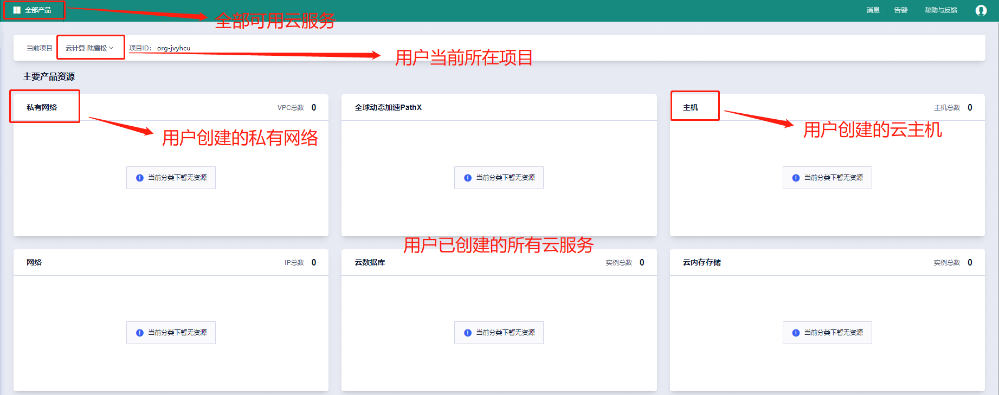

 
 

### 二）创建云主机

#### 1）从产品列表中选择“云主机”

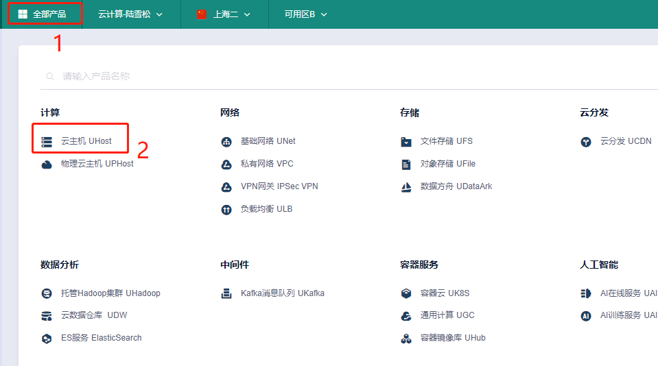

#### 2）选择配置（本实验使用基础配置即可）并创建，如果无法购买，请返回后尝试更换可用区，重新创建。

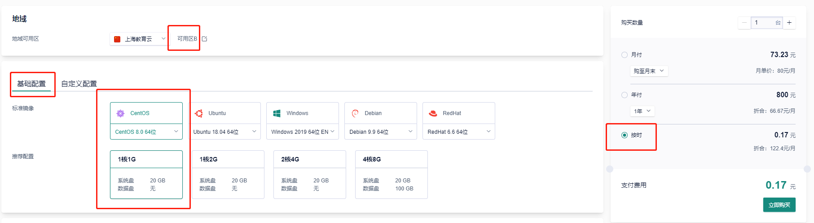

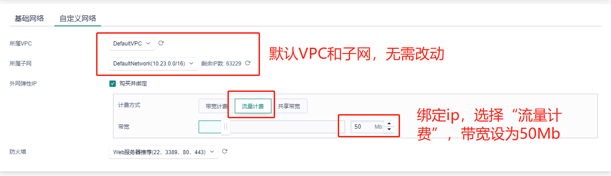

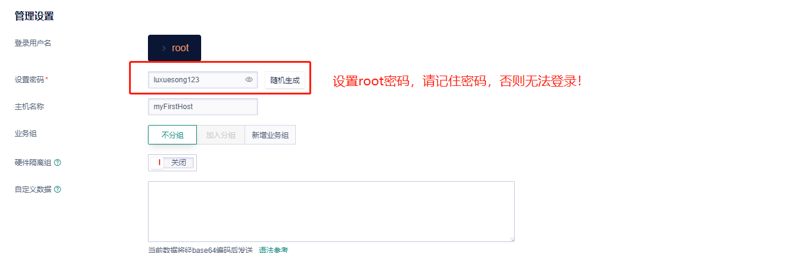

#### 3）配置完成后选择`“按时”`计费，点击“立即购买”->“立即支付”，等待云主机创建完成。创建完成后如下图所示。

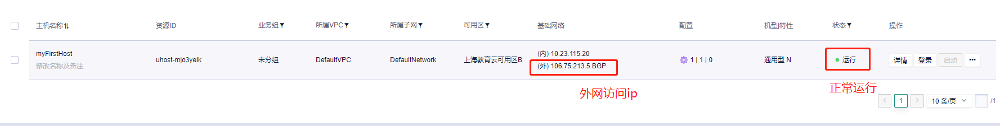

#### 4）登录云主机，打开ssh客户端（Mac/Linux的终端，Windows下推荐xshell）输入ssh root@你的云主机ip地址，回车并输入你设置的root密码。登录后界面如下图。

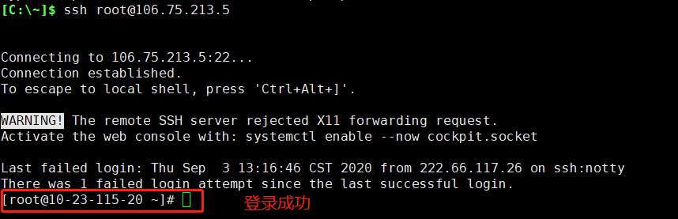

#### 5）创建你的个人账号，并赋予账号sudo（超级用户，等同root）权限。（提示：直接使用root账号有很多安全隐患，一般创建个人普通账号登录系统，如需管理员权限，则将个人账号提升为超级用户）

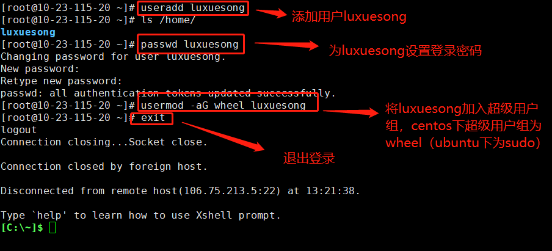

#### 6）退出root后，使用个人账号重新登录（ssh 你的个人账号@你的云主机ip）

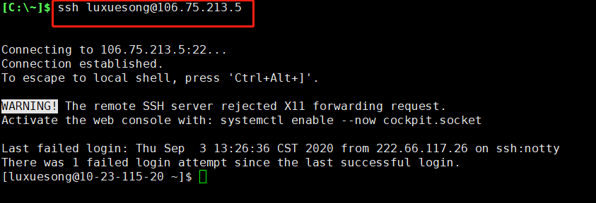

###  `**************作业1：请将个人账户登录界面截图，并插入实验报告中***************`

 
 

### 三）常用Linux命令练习

#### 1）什么是Linux Shell？

Shell是一个应用程序，接收从键盘输入的命令，并传递给操作系统，完成相应的任务。Linux shell就是Linux系统中使用的shell程序，通常情况下，Linux默认使用bash shell（/bin/bash），每行命令开头带一个$符号。用户通过在Shell中输入Linux命令，与操作系统进行交互。

`课后延伸练习`：[Learning the Shell](http://linuxcommand.org/lc3_learning_the_shell.php)

#### 2）导航命令

##### i) `pwd` (print working directory)：打印当前工作目录

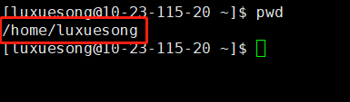

##### 提示：/home/你的用户名，是你的个人home目录。在这个目录下，你拥有所有权限（增删改查）。一般登录后会默认进入个人home目录。

##### ii) `cd` (change directory)：更改工作目录，请按下图所示进行练习。点击看大图。

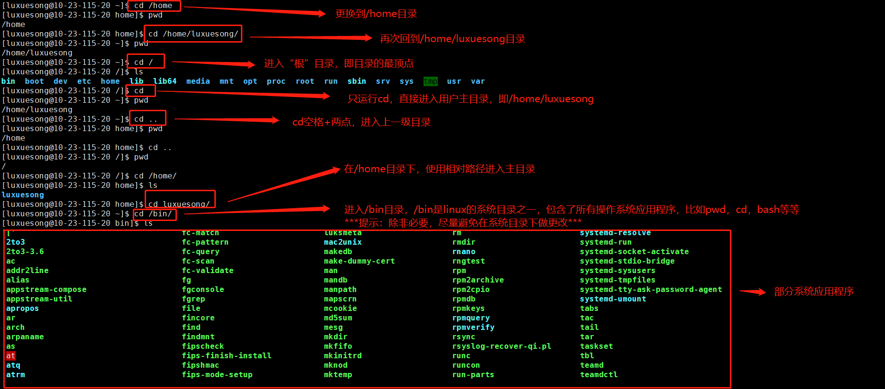

#### 3）文件查看命令

##### i) `ls` (list)：打印指定目录下所有文件名，如不指定目录，则打印当前目录下文件名。请按下图所示进行练习。

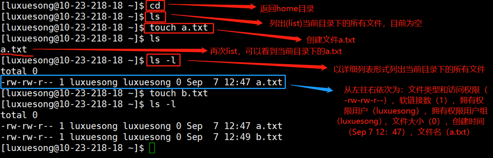

##### ii）上传文件到云主机

##### 下载一个有内容的文件[a-content.txt](file/assignment1/a-content.txt)。

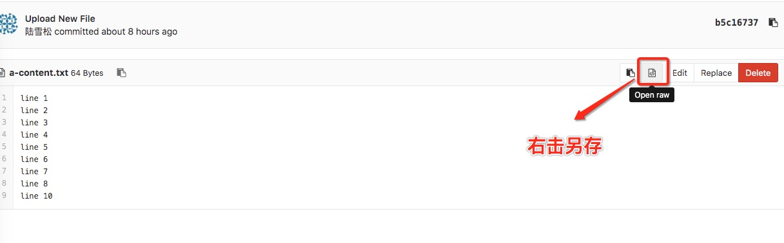

##### 上传a-content.txt到云主机

##### Mac/Linux系统中上传：在本地终端中运行`scp 存储路径/a-content.txt 你的用户名@你的云主机ip:/home/你的用户名/`，例如下图中，a-content.txt在/Users/xuesong/Downloads/files/目录下

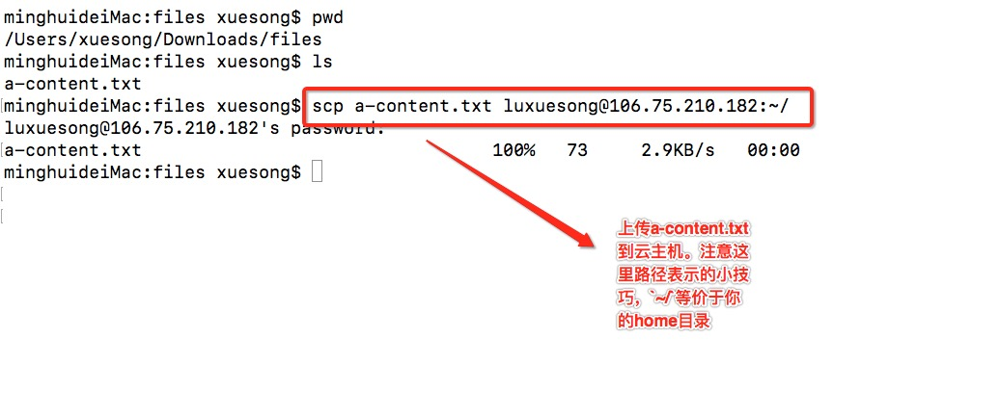

##### Windows系统中上传：在Xshell中打开Xftp，直接拖拽文件，如下图所示。

##### iii）`cat`：在屏幕上打印文件内容，如下图所示

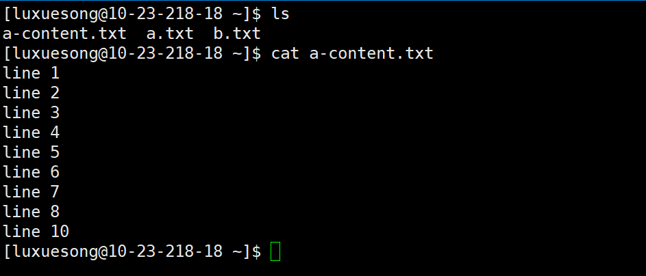

##### iv）`head/tail`：打印文件首/尾内容（查看大文件）。如下图，分别打印文件前5行和文件最后3行。

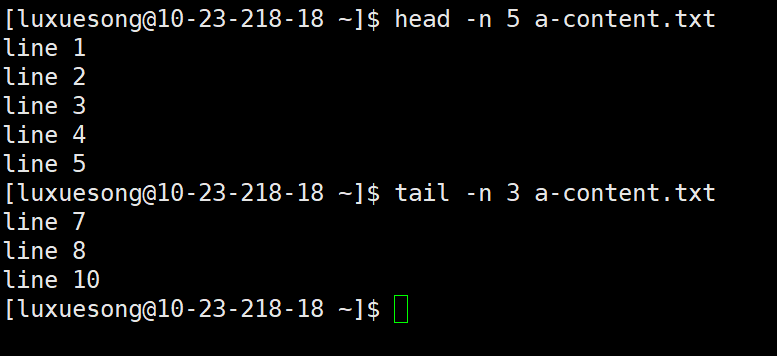

##### v）`grep`：打印包含指定内容的行（关键字符查找）。如下图，打印a-content.txt中包含"5"和"line 5"的行。

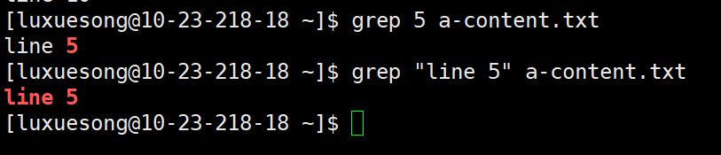

### `**************作业2：上传model.py，打印文件中定义的所有函数，并将打印结果截图插入实验报告。（提示：思考函数定义的共同点）**************`

### [点我下载model.py](file/assignment1/model.py)

#### 4）文件操作命令

##### i）`mkdir`：创建新目录

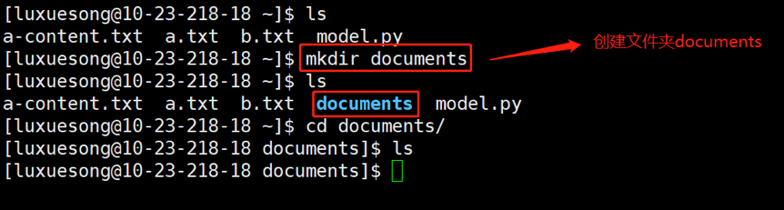

##### ii）`cp`：复制文件/文件夹（若复制文件夹，需加-r选项）

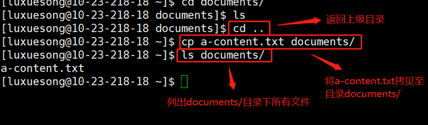

##### iii）`mv`：移动文件/文件夹

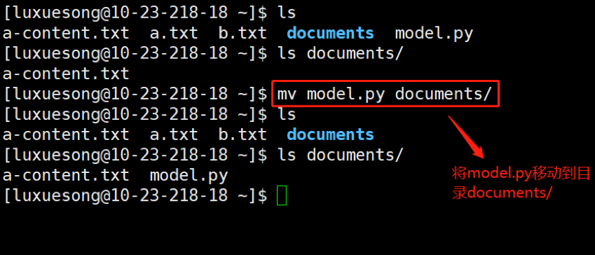

##### mv的另一个作用：重命名，用法：mv 旧文件名 新文件名

### `**************作业3，将a-content.txt重命名为a-content.csv，并截图**************`

##### iv）`rm`：删除文件/文件夹

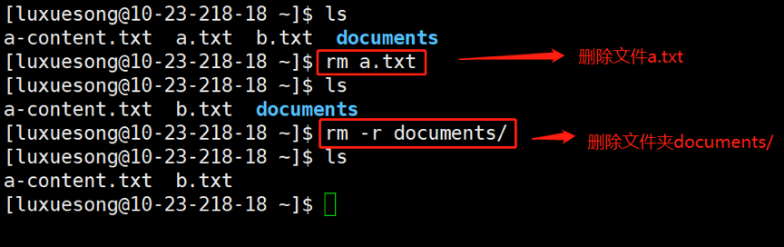

##### 提示：rm命令一定要慎用慎用再慎用，一旦删除无法找回。比较稳妥的操作，不用的文件，先用mv命令移动到/tmp/目录下，系统会定期清理。对系统文件禁用rm！！

##### v）`sort`：对文件内容进行排序，并打印。下载文件[b-content.txt](file/assignment1/b-content.txt)，上传到云主机你的个人home目录下，并按照下图练习sort。

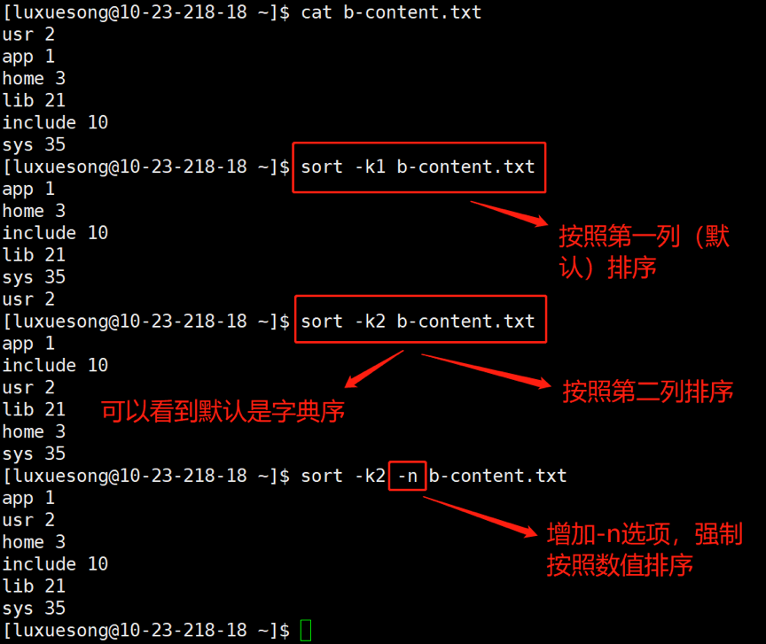

#### 5）Pipelines `|`：连接多个命令，前一个命令的打印输出作为后一个命令的输入（异常强大！！）。重新上传model.py（体会一下使用了rm的危险性 :stuck_out_tongue_winking_eye: ），并按照下图练习。

### `**************作业4：打印model.py第300行到400行之间的所有函数名，附上截图**************`

##  `******当你看到这句话时，实验已经结束，请立即删除云主机，节省费用！！！！！******`