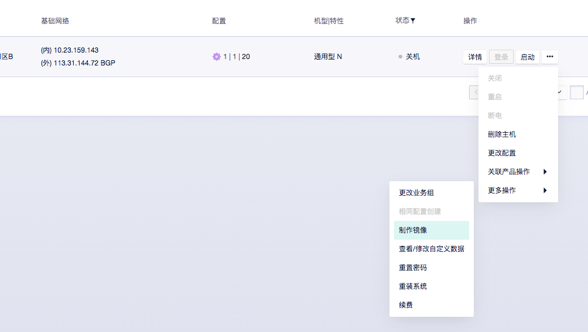
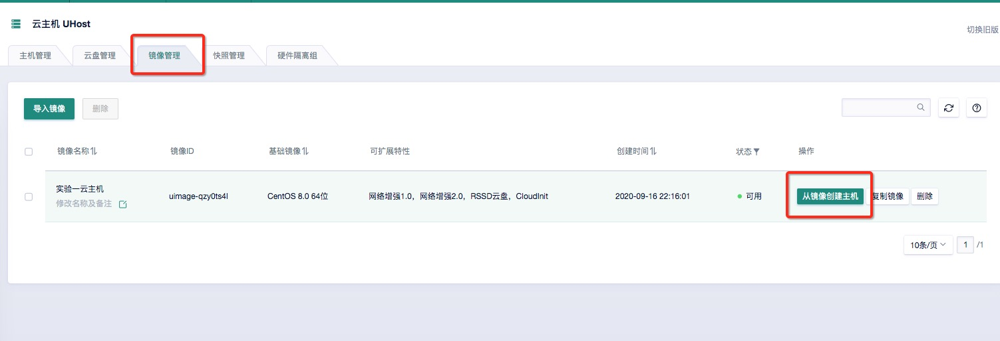
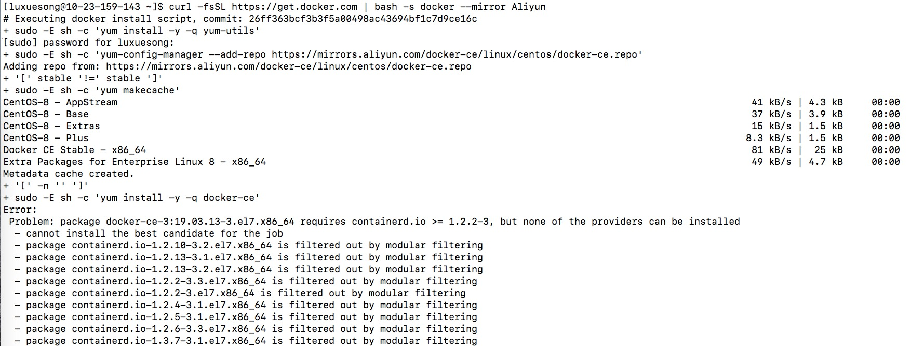
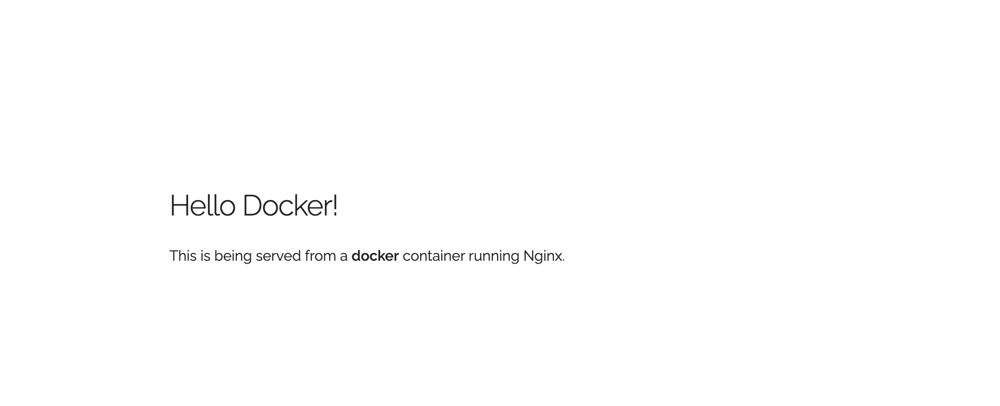
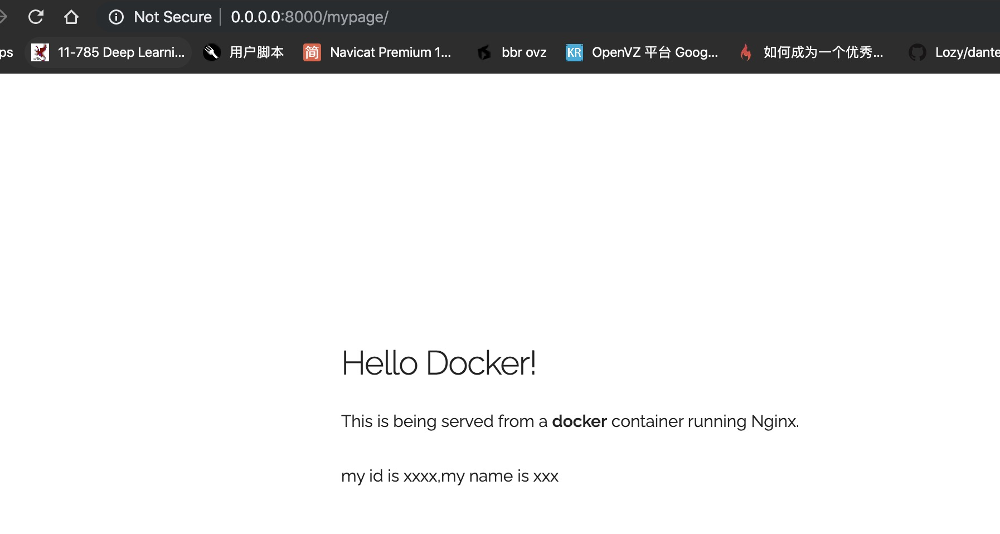

# Assignment 2 指南

##  `******注意，实验结束请立即删除云主机，节省费用******`

##  `******注意2，实验未结束且短期内不会继续实验，也请删除云主机。下次实验时重新创建******`

### 重要技巧：如果实验未结束，可以通过制作主机镜像来保存当前状态，下次实验时用这个镜像创建云主机，从当前状态开始继续实验。步骤如下

- 关机并制作镜像。制作完成后删除云主机。
- 下次从镜像创建云主机。

## 实验内容

- 安装Docker并测试：`实验步骤 一）`
- 了解并学习简单的Docker指令：`实验步骤 二）`
- 利用Docker部署一个简单的静态网页App ：`实验步骤 三）`
- 使用Dockerfile完成复杂应用的搭建：`实验步骤 四）`

## 实验要求（仔细看）

- #### 完成所有步骤，并在实验报告（[模板下载](file/assignment2/学号-实验二.docx)）中完成穿插在本指南中的`作业1～作业4`（只需要截图）。实验报告转成`“学号-实验二.pdf”`，并上传至http://113.31.104.68:3389/index.htm

- #### 实验报告上传deadline：`10月16日`

## 使用产品

云主机uhost, 私有网络vpc，基础网络unet, 容器镜像库uHub

## 需要权限

云主机uhost, 基础网络unet，容器镜像库uhub，容器服务udocker

## 实验步骤

### 零）前期工作

#### 请根据Assignment1的要求[创建云主机](Assignment1.md)，并使用ssh远程登录（可以直接使用root用户进行后续操作；如果登录个人账户进行操作，遇到permission问题时需在命令前面加上sudo再运行）

#### `Hint(重要):` 本实验需要访问云主机的host端口，请使用`-L `命令将云主机的`32768、32769、8000、8080`四个端口映射到本地，具体命令可以参考如下：

```bash
$ ssh root@你的云主机外网ip -L 32769:0.0.0.0:32769 -L 32768:0.0.0.0:32768 -L 8080:0.0.0.0:8080 -L 8000:0.0.0.0:8000
```


### 一）安装Docker并测试

#### 1. Docker是什么？

> 一个开放源代码项目，通过在Linux上提供**OS级虚拟化**的附加抽象层和自动化层，使**容器**内软件应用程序的部署自动化。

#### 简单来说，Docker是一种工具，它使开发人员，系统管理员等可以轻松地在沙盒（称为*容器*）中部署其应用程序，以在主机操作系统运行。Docker的主要好处是，它允许用户将**具有所有依赖关系的应用程序打包到**用于软件开发**的标准化单元**中。与虚拟机不同，容器不具有高开销，因此可以更有效地利用基础系统和资源。

#### 2. 在Linux上安装Docker环境

> 直到几个版本之前，在OSX和Windows上运行Docker还是很麻烦的。但是，最近，Docker已投入大量资金来改善其用户在这些OS上的体验，因此，现在运行Docker是一个轻而易举的事。

#### 这里只介绍如何在Linux上安装和运行Docker, 如果同学们想要在其他系统上尝试使用Docker，可以参考Docker官网给出的教程（如何在[Mac](https://docs.docker.com/docker-for-mac/install)、[Linux](https://docs.docker.com/install/linux/docker-ce/ubuntu)或[Windows]([Windows](https://docs.docker.com/docker-for-windows/install))上使用Docker）

#### a) 安装docker

#### 推荐使用如下命令安装docker

```bash
$ curl -fsSL https://get.docker.com | bash -s docker --mirror Aliyun
```

#### 如果遇到如下图所示错误，请先运行下面的命令后再重新安装docker
```bash
$ yum install -y https://download.docker.com/linux/centos/7/x86_64/stable/Packages/containerd.io-1.2.6-3.3.el7.x86_64.rpm
```


#### 按照提示将自己的用户加入docker的用户组(root 用户无需操作)

```bash
$ sudo usermod -aG docker yourusername
```

#### 基本的docker启动与查看状态命令如下

```bash
$ service docker start
$ service docker stop
$ service docker restart

$ service docker status

● docker.service - Docker Application Container Engine
   Loaded: loaded (/usr/lib/systemd/system/docker.service; disabled; vendor preset: disabled)
   Active: active (running) since Mon 2020-10-05 21:34:37 CST; 1min 45s ago
     Docs: https://docs.docker.com
 Main PID: 1954 (dockerd)
    Tasks: 8
   Memory: 40.1M
   CGroup: /system.slice/docker.service
           └─1954 /usr/bin/dockerd -H fd:// --containerd=/run/containerd/containerd.sock
```

## **为保证试验正常进行，请根据以下步骤修改docker镜像源从默认镜像库改为ucloud镜像库**

### hint：docker镜像库中包含大量可用镜像，可以直接下载到本地使用，常用的镜像库比如https://hub.docker.com/

#### 1.登录`ucloud docker hub`，其中username是你的ucloud账号（邮箱），密码是ucloud账号密码

```bash
$ docker login uhub-edu.service.ucloud.cn -u username

Password: 
WARNING! Your password will be stored unencrypted in /root/.docker/config.json.
Configure a credential helper to remove this warning. See
https://docs.docker.com/engine/reference/commandline/login/#credentials-store

Login Succeeded
```

#### 出现`login succeeded`表示登陆成功

#### 2.将如下内容写入`/etc/docker/daemon.json`中（没有此文件则需要新建. ps: 需保证`docker`已经运行过，否则会出现`/etc/docker`文件夹不存在）

```json
{
    "registry-mirrors": ["https://uhub-edu.service.ucloud.cn","https://uhub.service.ucloud.cn","https://registry.docker-cn.com","http://hub-mirror.c.163.com"]
}
```

#### hint：可以使用`nano`命令直接在云主机上编辑daemon.json，使用方法请自行查找。也可以在本地用纯文本编辑器（如txt）编辑，然后上传到云主机。

#### 之后重新启动`docker`即可

#### b) 测试Docker是否安装成功

#### 当你的按照上述步骤安装完docker之后，可以通过运行如下命令来测试docker是否安装成功

```bash
$ docker run hello-world

Hello from Docker.
This message shows that your installation appears to be working correctly.
...
```

#### 3. 尝试使用busybox

> 到此为止，你的docker环境已经安装完成并且正常运行，接下来我们尝试一些更加复杂的工作

#### 在这个部分，我们将要通过`docker run`命令去开启一个`BusyBox container`

#### a) 首先，我们通过运行如下命令从镜像库拉取`BusyBox`的镜像: 

```bash
$ docker pull busybox
```

> 如果运行过程中遇到  **permission denied** 此类的错误，可以尝试在命令前加入 **sudo** 命令

#### b) **pull** 命令可以将`busybox image`从docker仓库中拉取到本地，你可以使用**docker image**命令查看系统上目前已有的**image**. 

```bash
$ docker images

REPOSITORY 	TAG 	IMAGE ID 		CREATED			VIRT
busybox 	latest 	c51f86c28340 	4 weeks ago 	1.10
```

#### c) 我们接下来继续尝试使用`docker run`命令来运行`busybox`

```bash
$ docker run busybox
$
```

#### d) 可以发现命令运行完，什么也没有发生。这不是bug，当我们执行`docker run`命令时，docker会从本地查找`image`，然后加载`image`生成`container`容器，并在其中运行command。正因为我们没有运行任何command，此容器没有任何输出。让我们加入自定义的command再试一次。

```bash
$ docker run busybox echo "hello from busybox"
hello from busybox
```
##### hint：通常,docker image不在运行时叫image，加载运行以后叫container

`**************作业1：请将上述涉及docker run/image的操作界面截图，并插入实验报告中***************`

### 二) 熟悉Docker指令

#### 让我们来尝试不同的**docker command**

#### 1. docker ps

> **docker ps** 命令可以查看当前正在运行的所有容器的状态，包括`CONTAINER ID`、`IMAGE`、`COMMAND`、`CREATE (创建时间)`、`STATUS (容器状态)`

#### 让我们查看目前有哪些容器正在运行

```bash
$ docker ps

CONTAINER ID 	IMAGE 	COMMAND 	CREATED	 STATUS
```

#### 可以看到控制台输出了了一个空的列表，这是正常的，因为目前没有容器正在运行。如果需要查看包括不在运行的所有容器，我们可以加入 **-a** 参数

```bash
$ docker ps -a

CONTAINER ID 			IMAGE 					COMMAND 			CREATED 			STATUS
305297d7a235 			busybox 				"uptime" 			11 minutes ago 		Exited (
ff0a5c3750b9 			busybox 				"sh" 				12 minutes ago 		Exited (
14e5bd11d164 			hello-world 			"/hello" 			2 minutes ago 		Exited (
```

#### Wow~ 之前运行过的容器全部都出现在输出中了~

#### 2. docker run -it

> **docker run -it** 可以在我们创建 **container** 的同时，以交互式的形式获取到 **container shell** 的控制权. 我们可以在**docker run **命令中使用**--name custom_name** 来指定container的名称，若不指定，docker会为我们随机生成一个名字

#### 接下来我们使用 **run -it** 命令来创建一个 `busybox container`，并在其中运行几个linux命令（回想：容器是一个虚拟化的环境，里面也运行了一个"轻量级的操作系统"）

```bash
$ docker run -it busybox sh


/ # ls
bin dev etc home proc root sys tmp usr var
/ # uptime
05:45:21 up 5:58, 0 users, load average: 0.00, 0.01, 0.04
/ # cd home && pwd
/home
/ # exit
```

#### 3. docker rm

> **docker rm -args** 可以删除不在运行的**container**，`args`可以是**container name/id** (可以不写完整，但必须保证唯一)

####  下面让我们尝试删除上面的两个**busybox container**

```bash
$ docker rm 305297d7a235 ff0a5c3750b9

305297d7a235
ff0a5c3750b9
```

#### 也可以通过如下命令删除

```bash
$ docker rm 305 ff
305297d7a235
ff0a5c3750b9
```

#### 现在使用`ps`命令检查一下是否删除成功吧！

`**************作业2：请手动创建centos image的container,将终端命令和`container cpu`信息截图，并插入实验报告中***************`

> Hint1: image名称即为centos

> Hint2: 可以使用**lscpu**命令在container中查看linux的硬件信息，显示界面大致如下

```bash
$ lscpu

Architecture:        x86_64
CPU op-mode(s):      32-bit, 64-bit
Byte Order:          Little Endian
CPU(s):              4
On-line CPU(s) list: 0-3
Thread(s) per core:  1
Core(s) per socket:  1
Socket(s):           4
Vendor ID:           GenuineIntel
CPU family:          6
Model:               158
Model name:          Intel(R) Core(TM) i7-7700HQ CPU @ 2.80GHz
Stepping:            9
CPU MHz:             2800.000
BogoMIPS:            5616.00
L1d cache:           32K
L1i cache:           32K
L2 cache:            256K
L3 cache:            6144K
...
```

### 三) 使用docker创建静态webapp

#### `docker`与虚拟机不同之处在于，在部署复杂的应用时，`docker`可以灵活的从`docker hub`中`pull`各种`image`（如：`mysql`、`sqlserver`、`java`、`php`.etc.），并将它们自由的组合到一起，使得每个`container`都能发挥自己独特的作用。那么我们先从简单的部署单页面的静态网页开始吧！

#### 1. 运行`static-web app`

#### `docker hub`上有许多开发者们上传的`image`，我们可以自由下载并且使用，这里我们使用到的`image`是`cloud_computing/static_site`,这是一个搭载了简单的静态单页面的Nginx镜像，让我们来试者运行它：

```bash
$ docker run --rm cloud_computing/static_site

Nginx is running...
```

> `--rm` 参数的作用是当container运行结束时系统自动删除该container

#### 如果顺利的话，你的终端会出现`nginx is running...`,但是目前容器对我们来说是一个完全封闭的环境，我们并没有办法去访问`container`的端口

#### 2. 将`container`映射到本地

到此为止，我们已经部署了一个静态的`nginx container`但是并没有办法去访问，`docker`提供了许多接口去解决这个问题，我们可以通过添加参数的方式将`container`的端口或者文件夹映射到本地

#### docker提供了如下一些参数

|              -d               |                   将container置于后台运行                    |
| :---------------------------: | :----------------------------------------------------------: |
| -p local_port:container_port  |               将container 的某个端口映射到本地               |
|              -P               |    将container所有正在监听的端口全部映射到本地的随机端口     |
| -v local_path:contatiner_path | 将本地的local_path文件夹映射到container的container_path文件夹并保持同步 |

 `**关于-v参数的说明，当你使用到-v 参数时，如**`

```bash
docker run -d -v /home/data:/var/data --name test ubuntu
```

 `**那么相当于你将本地的/home/data目录映射到container的/var/data目录，container的/var/data目录会和你的本地目录保持同步，同时,若/var/data目录不存在，docker会自动创建，反之，目录中的内容会被全部覆盖掉(和本地的/home/data保持同步)，希望同学们好好理解**`

####  `static-site`默认监听的`80`和`443`端口我们使用上述参数尝试将它映射到本机

```bash
$ docker run -d -P --name static_site cloud_computing/static_site

e61d12292d69556eabe2a44c16cbd54486b2527e2ce4f95438e504afb7b02810
```

#### 查看docker给我们映射的端口

```
$ docker port static_site

80/tcp -> 0.0.0.0:32769
443/tcp -> 0.0.0.0:32768
```

#### 可以看到`docker`将`container`的`80`和`443`分别映射到了本机的`32769`和`32768`两个端口上

#### 3.打开浏览器，访问`http://localhost:32769`，得到如下页面：(若`docker`随机映射端口不是`32768/32769`可以无需验证此步骤)



`**************作业3：尝试使用-v、--rm和-p (请将container的80端口映射到host的8000端口)等参数，创建cloud_computing/static_site容器***************`

#### 具体步骤如下: 

#### 1.若提示continer正在运行中，可以使用`docker stop static_site && docker rm static_site`删除正在使用的容器并重新创建.

#### 2. 创建`/var/html`文件夹

```bash
mkdir /var/html
```

#### 3.在`/var/html`中新建`index.html`文件，复制[index.html文件](file/assignment2/index.html)中的内容到文件中，并修改以下部分为自己的信息

```html
 <div class="container">
    <div class="row">
      <div class="one-half column" style="margin-top: 25%">
        <h4>Hello Docker!</h4>
        <p>This is being served from a <strong>docker</strong> container running Nginx.</p>
		<p>my id is xxxx,my name is xxx</p>
      </div>
    </div>
  </div>
```

#### 4. 尝试使用`-p、-v、-d、--rm、--name`参数创建`cloud_computing/static_site`的`container`，具体要求为：映射`container`的`80`端口到`host`的`8000`端口，映射`container`的`/usr/share/nginx/html/mypage`路径到`/var/html`文件夹，`container`名称以自己的学号命名

#### 5.访问本地浏览器:`http://localhost:8000/mypage`

#### 6.将浏览器界面包括url截图，将创建container的终端界面截图，并插入到实验报告中 (浏览器界面类似下面图片所示)



### 四) 熟悉Dockerfile的简单使用

#### 到现在为止，同学可能会疑惑，这种docker的镜像到底是如何创建的呢？这里就要使用到一个概念: `Dockerfile`

#### 1.从repo中下载[附件](/file/assignment2/demo.zip)，通过`scp`命令上传到云服务器并解压

```bash
$ scp demo.zip root@113.31.105.65:~

root@113.31.105.65's password: 
demo.zip                                      100% 1308   142.4KB/s   00:00

$ unzip demo.zip 

Archive:  demo.zip
   creating: demo/
  inflating: __MACOSX/._demo         
  inflating: demo/Dockerfile         
  inflating: demo/app.py  
```

#### 2.查看Dockerfile

#### 这是一个`Flask App`,是一个用`python`写的网页应用，我们进入`demo`文件夹,只有两个文件`app.py、Dockerfile`

#### 首先我们使用`cat app.py`命令查看`app.py`的内容，显示如下：

```python
from flask import Flask

app = Flask(__name__)

@app.route('/')
def hello():
    return 'hello world!'

if __name__ == '__main__':
    app.run(host='0.0.0.0')
```

#### 看不懂没有关系，这就是一个很简单的flask应用，它定义了一个路由，当我们访问:`http://localhost:5000/`的时候，浏览器会给我们返回`hello world!`

#### 接下来我们继续查看`Dockerfile`：

```dockerfile
# 拉取python镜像作为基本环境
FROM cloud_computing/python:latest

# 设置额外信息
LABEL description="Dockerfile Demo for ECNU"

# 在container中运行命令（这一步在container安装pip依赖）
RUN pip install flask -i https://pypi.tuna.tsinghua.edu.cn/simple

# 将本地目录拷贝到container并且设置为工作目录
ADD ./app.py /opt
WORKDIR /opt

# 将5000端口暴露出来
EXPOSE 5000

# 容器启动的执行命令
CMD python app.py
```

#### 可以看出`Dockerfile`的书写非常简单易懂，涉及到几个命令

|  FROM   |                      指定容器来自的镜像                      |
| :-----: | :----------------------------------------------------------: |
|   RUN   |                     容器中运行shell命令                      |
|   ADD   |                 将本地文件传送到容器指定位置                 |
| WORKDIR |          将容器中某个目录设置为工作目录（当前目录）          |
| EXPOSE  | 将容器中某个端口暴露出来（如上述flask工作在5000端口，将其暴露出来） |
|   CMD   |                 容器启动自动执行的shell命令                  |
|  LABEL  |                      设置一些额外的信息                      |

#### 通过`dockerfile`的方式，我们就可以将各种各样的环境打包成镜像上传到`docker hub`上供他人使用

#### 3.打包镜像

#### 在当前目录（`Dockerfile`同级目录），执行如下命令，`docker`会自动将当前环境部署打包为一个`image`

```bash
$ docker build -t user-name/image-name .
```

#### 通过上面的命令，我们就在本地打包好了一个名叫`username/image-name`的镜像，我们可以通过之前学习的`docker run`命令去创建该镜像的`container`

**************作业4：利用dockerfile将当前环境打包为 `英文姓名/demo` 的`image`，并通过`docker`命令将创建该镜像的`container`，将`5000`端口映射到本地的`8080`端口。将打包镜像的命令、创建容器的命令以及浏览器页面截图，并插入实验报告中***************

