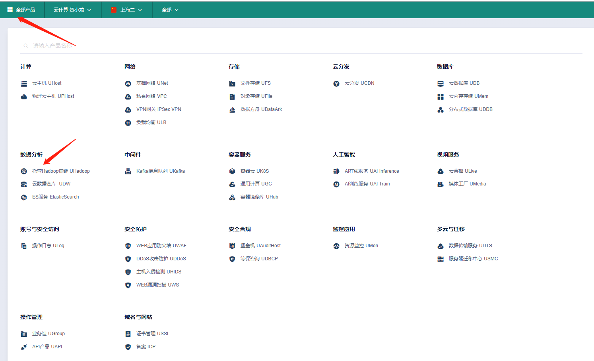
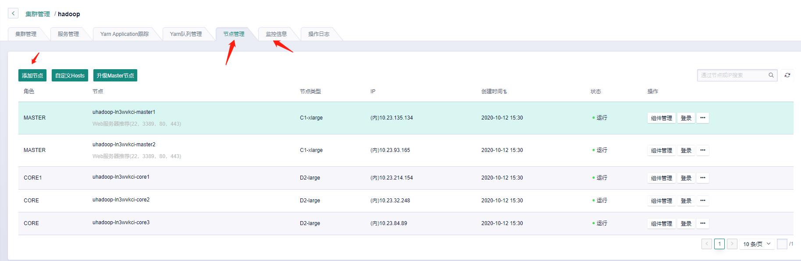
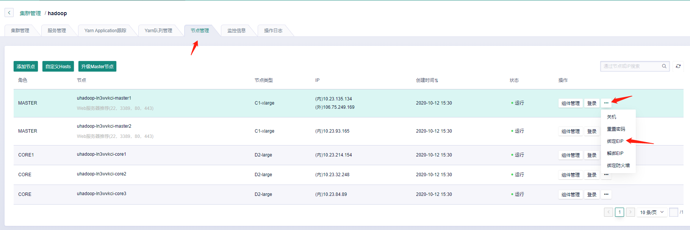
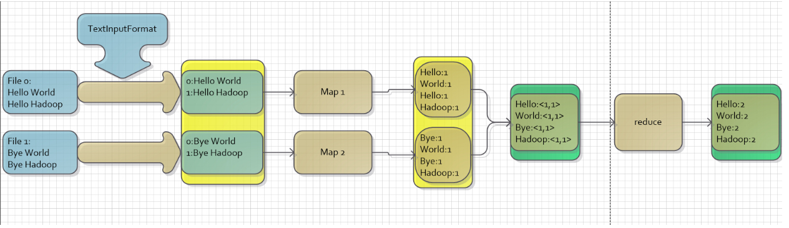

# Assignment 3 指南

`******注意，实验结束请立即删除云主机，节省费用******` 

`******注意2，实验未结束且短期内不会继续实验，也请删除云主机。下次实验时重新创建******` 


##  实验内容

- 安装Hadoop集群:  `实验步骤  一)` 
- 了解并学习简单的Hadoop操作 ：`实验步骤  二)  `
-  安装Hadoop客户端:  `实验步骤  三)`
-  MapReduce Job `实验步骤 四）`

## 实验要求（仔细看）

- 完成所有步骤，并在实验报告（[模板下载](file/assignment3/学号-实验三.docx))中完成穿插在本指南中的作业1～作业4（只需要截图）。实验报告转成“学号-实验三.pdf”，并上传至http://113.31.104.68:3389/index.htm
- 实验报告上传deadline： `10月23日 `

## 使用产品 

​       托管Hadoop集群UHadoop  、云主机uhost 、 私有网络vpc 、基础网络unet

## 需要权限

​	托管Hadoop集群UHadoop 、 云主机uhost 、 基础网络unet 

## 基础知识

​    **Hadoop**：一个分布式系统基础架构，由Apache基金会开发。用户可以在不了解分布式底层细节的情况下，开发分布式程序。充分利用集群的威力高速运算和存储。

   **Distributed**：分布式计算是利用互联网上的计算机的 CPU 的共同处理能力来解决大型计算问题的一种计算科学。

   **File system**：文件系统是操作系统用于明确磁盘或分区上的文件的方法和数据结构；即在磁盘上组织文件的方法。也指用于存储文件的磁盘或分区，或文件系统种类。

   **Hadoop 和 HDFS 的关系**

       - Hadoop实现了一个分布式文件系统（Hadoop Distributed File System），简称HDFS。
       - 对外部客户机而言，HDFS 就像一个传统的分级文件系统。可以创建、删除、移动或重命名文件，等等。很多时候，我们就叫它DFS（Distributed File System）。
       - Hadoop 是一个以一种可靠、高效、可伸缩的方式进行处理的，能够对大量数据进行分布式处理的系统框架。
       - HDFS是Hadoop兼容最好的标准级文件系统，因为Hadoop是一个综合性的文件系统抽象，所以HDFS不是Hadoop必需的。所以可以理解为Hadoop是一个框架，HDFS是Hadoop中的一个部件。

#### 实验步骤

### 一）安装Hadoop集群

#### 进入产品页面

在“全部产品”菜单中点击“托管Hadoop集群 UHadoop”  进入产品页面。



#### 创建集群


​      

​       

​        **节点设置不需要改变，付费方式选择`按时`付费**

​        **根据集群规模不同，所需要的部署时间会有所差异，创建时间基本在`15分钟`左右。初始，集群的转态是  `创建/部署`中 ，需等到 状态变为 `运行` 才能操作集群**

#### 管理集群

​      **在管理页面，我们可以查看集群中节点的信息、增加/关掉  节点、 升级节点配置、查看监控信息和操作日志等**

####  登录集群

绑定外网eip。 目前仅master节点支持绑定

​     **基础网络 ------> 申请EIP  (选择按时收费)**

​    


​     

​                    **管理页面  --------->  节点管理  -------------> 绑定EIP**    

​                       

​          **本地可通过外网ssh连接登录**

​            `ssh root@106.75.249.169`       **ip为绑定的外网IP,密码为初始创建集群时的密码**

​           **查看HDFS状态，节点信息**

          1. su hadoop  切换到hadoop用户
          2. hdfs dfsadmin -report   查看信息
          3. exit (用完退出该用户，避免后续出现操作权限问题)


`**************作业1：请将上述查看到的节点信息截图，并插入实验报告中***************`


### 二）熟悉基本命令

>   Hadoop实现了一个分布式文件系统（Hadoop Distributed File System），简称HDFS。  我们可以登录Master节点通过一些基本命令操作文件，操作的命令与我们在Linux系统命令类似。`所有的操作都在root用户下执行，避免出现权限问题` 

#### 列出文件

>  hadoop fs  -ls   <path>     
>
>  eg : hadoop fs -ls /

#### 创建目录

> hadoop fs -mkdir <paths>    接受路径指定的uri作为参数，创建这些目录。其行为类似于Unix的mkdir -p，它会创建路径中的各级父目录。
>
> eg： hadoop fs -mkdir /dir1 /dir2   (该目录时被创建在HDFS文件系统中，而不是本地文件系统) 

#### 上传文件

> hadoop fs   -put  <localsrc>   <dst>   从本地文件系统中上传文件到HDFS文件系统中
>
> eg:   hadoop fs -put   /root/install-java.sh    /dir1                              本地文件 ： /root/install-java.sh         HDFS文件系统中文件夹 ： /dir1

#### 下载文件

> hadoop fs    -get     <src>    <localdst>     从HDFS文件系统中下载文件到本地
>
> mkdir test   &&   hadoop fs -get    /dir1/install-java.sh   /root/test

#### 检查文件

> 使用方法：hadoop fs -test -[ezd]  url
>
> 选项：
> -e 检查文件是否存在。如果存在则返回0。
> -z 检查文件是否是0字节。如果是则返回0。
> -d 如果路径是个目录，则返回1，否则返回0。
>
> 示例：
>
> - hadoop fs -test -e filename     

**更多请参考： hadoop fs -help    也可以参考 ：[Hadoop FS Shell使用指南](https://hadoop.apache.org/docs/r1.0.4/cn/hdfs_shell.html)** 


`**************作业2：按照如下要求操作命令并截图，并插入实验报告中***************`

 `作业二要求：` 

> 1. 在本地文件系统生成一个info.txt文件  里面内容是 ：云计算实验课:学号-姓名      eg: echo "云计算实验课:0001-张三" > info.txt
>
> 2. 在HDFS文件系统中创建文件夹 test, 然后将该文件上传到该文件夹中  `使用 mkdir 和 put `
>
> 3. 使用cat命令查看文件内容并截图  `截图中需要包含文件夹信息`      （查看的是HDFS文件系统中的info,txt，而不是本地文件系统）      
>
>    `操作时注意使用的用户和目录，避免出现permission denied问题`

###  三） 客户端搭建

> 上述的操作命令我们都是在Hadoop集群上直接操作的，出于安全性考虑，通常我们在单独的机器上安装客户端进行任务提交和相关操作。

#### 按照实验一的步骤 申请一台UHost云主机（CentOS操作系统）。

#### 配置环境

>  我们需要配置云主机的环境，让能够正常访问HDFS文件系统。

#####   利用安装脚本部署

- 在**hadoop集群的master节点**下载安装脚本：

  ```
  wget "http://udata-new.ufile.ucloud.com.cn/uhadoop/install_uhadoop_client_new.sh"
  ```

  使用方法：

  在master节点/root目录下执行

  ```
  sh /root/install_uhadoop_client_new.sh client_ip client_user password port
  client_ip: 客户机IP  (申请的UHost)
  client_user: 客户机上需要安装客户端的用户名（root）
  password: 客户机root密码
  port：客户机ssh连接端口 (通常是22)
  ```

​        **该脚本会自动安装java环境、hadoop环境，并修改环境变量，安装过程中，需要确认安装（y）**。

​        **安装完成后，需要在UHost云主机上执行  source ~/.bashrc   命令让修改的环境生效**

​         **同样我们可以在该UHost上执行HDFS基础操作**

`**************作业3：按照如下要求操作命令并截图，并插入实验报告中***************`

​      `作业三要求：`

> 在UHost云主机上删除作业二中创建的文件和文件夹并截图 

### 四）MapReduce Job

> MapReduce是一种分布式计算框架 ，以一种可靠的，具有容错能力的方式并行地处理上TB级别的海量数据集。MR有两个阶段组成：Map和Reduce，用户只需实现map()和reduce()两个函数，即可实现分布式计算。在/home/hadoop/hadoop-examples.jar 中有很多简单的MapReduce实例程序。我们可以通过在master节点执行命令 ` hadoop jar /home/hadoop/hadoop-examples.jar`   可以看到可以运行的实例程序。


#### 统计词频

- 创建目录，并上传测试数据（`所有操作在集群的master节点执行`）

```
hadoop fs -mkdir /input
hadoop fs -put /home/hadoop/conf/* /input
```

- 执行WordCount任务

```
hadoop jar /home/hadoop/hadoop-examples.jar wordcount /input /output   如果/output目录已存在，请删除该目录或使用其他目录。
```

- 查看wordcount任务的结果

```
 hadoop fs -cat /output/part-r-00000
```

`**************作业4：统计/home/hadoop/etc/hadoop目录下所有文件的词频并截图，插入实验报告中***************`


`******特别注意，做完作业4 即可请删除UHadoop集群、EIP 和UHost主机等资源******`

#### WordCount 实现原理

> MapReduce主要分为两步Map步和Reduce步，引用网上流传很广的一个故事来解释，现在你要统计一个图书馆里面有多少本书，为了完成这个任务，你可以指派小明去统计书架1，指派小红去统计书架2，这个指派的过程就是Map步，最后，每个人统计完属于自己负责的书架后，再对每个人的结果进行累加统计，这个过程就是Reduce步。下图是WordCount的实现原理图，[WordCount实现](https://hadoop.apache.org/docs/r1.0.4/cn/mapred_tutorial.html#用法)。

    

`**************作业5：用任一语言实现单线程的WordCount，记录运行时间，然后给出运行时间截图，插入实验报告中***************`

 `作业要求`

> 需要统计的文件夹： [/home/hadoop/etc/hadoop](file/assignment3/hadoop/)   (将文件夹从hdfs拷贝到本地，然后就可以删除hadoop集群)
>
> 在本地执行，并记录执行时间


