# Assignment 4 指南

## `******注意，实验结束请立即删除云主机和数据库，节省费用******` 

## `******注意2，实验未结束且短期内不会继续实验，也请删除云主机和数据库。下次实验时重新创建******` 


##  实验内容

- 创建MySQL数据库实例并登录:  `实验步骤 一)` 
- 创建数据库表：`实验步骤 二)`
- 使用Wordpress和MySQL创建个人博客: `实验步骤  三)`

## 实验要求（仔细看）

- 完成所有步骤，并在实验报告（[模板下载](file/assignment4/学号-实验四.docx))中完成穿插在本指南中的作业1～作业4（只需要截图）。实验报告转成“学号-实验四.pdf”，并上传至http://113.31.104.68:3389/index.htm
- 实验报告上传deadline： `11月6日`

## 使用产品 

云数据库UDB、云主机uhost、私有网络vpc、基础网络unet

## 需要权限

云数据库UDB、云主机uhost、基础网络unet


## 基础知识（本实验详细知识会在数据库系统课程中学习，这里我们仅简单熟悉一下相关操作，你也可以去Google上Baidu一下相关知识 :ghost: :ghost: :ghost:）


`数据库:` 又称数据管理系统，是计算机系统中数据存储和访问的一种有组织的集合，通常作为独立的模块为应用程序提供数据读写支持。经典的（关系型）数据库系统如Oracle Database，Microsoft SQL Server，IBM Db2，以及开源数据库如MySQL，PostgreSQL等。

`云数据库:` 云数据库是基于云计算技术的高可用、高性能的数据库托管服务，能够在几十秒内完成数据库部署、设置、操作和扩展，简化了数据库运维工作，有利于用户专注于应用程序研发及业务的发展。

`分布式数据库:` 分布式数据库是用计算机网络将物理上分散的多个数据库单元连接起来组成的一个逻辑上统一的数据库。互联网经济时代业务存储的数据量增多和访问量增大，都构成对单机数据库的挑战，为提高吞吐量和降低单机数据库scale up的成本问题，分布式数据应运而生。


## 实验步骤

### 一）创建MySQL云数据库实例并登录

#### 1）在产品中选择云数据库UDB
<kbd>
  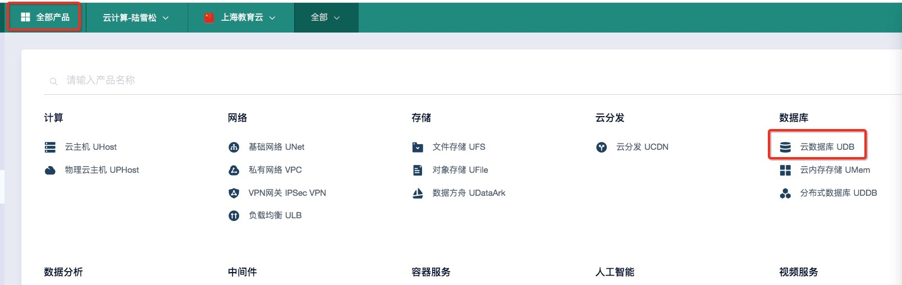
</kbd>

#### 2）让我们看看在UCloud上可以创建哪些数据库 :blush:
<kbd>
  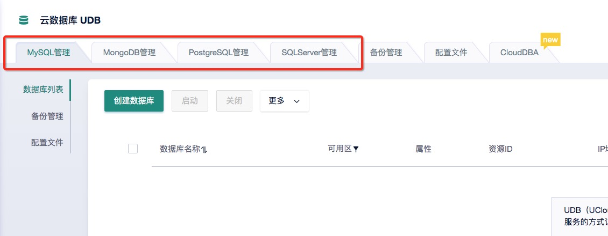
</kbd>

> `MySQL:` 原本是一个开源关系型数据库管理系统，原开发者为瑞典的MySQL AB公司，该公司于2008年被Sun收购，后Sun公司于2009年被Oracle收购，MySQL成为Oracle旗下产品。与此同时，MySQL原作者Michael Widenius fork了开源MySQL项目，创建了MariaDB，继续保持在GNU GPL下开源。

> `MongoDB:` 面向文档的非关系型（NoSQL）数据库管理系统，使用类JSON的文档存储数据。 MongoDB由MongoDB Inc.开发。

> `PostgreSQL:` 或称Postgres，开源数据库管理系统，强调extensibility，可以同时用作关系型数据库，时序数据数据库和数据仓库的解决方案。

> `SQL Server:` 微软开发的关系型数据库管理系统，最早由微软和Sybase合作开发，从SQL Server 6.0版开始，由微软独立开发。


#### 3）以上知识看看就好，没啥用处 :stuck_out_tongue_winking_eye: 还是让我们创建一个MySQL数据库玩玩吧 :smirk:
<kbd>
  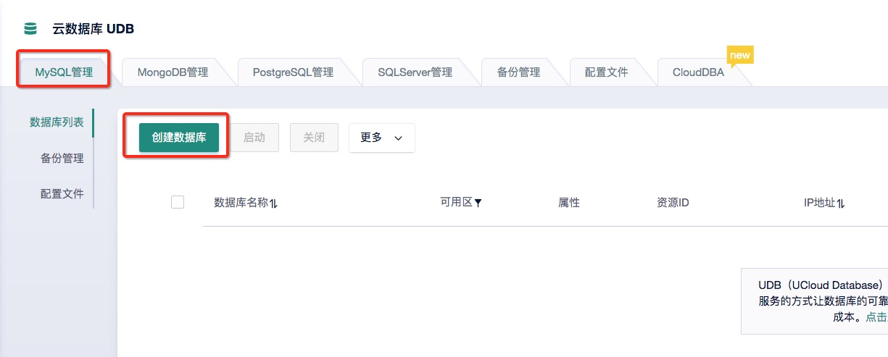
</kbd>

<kbd>
  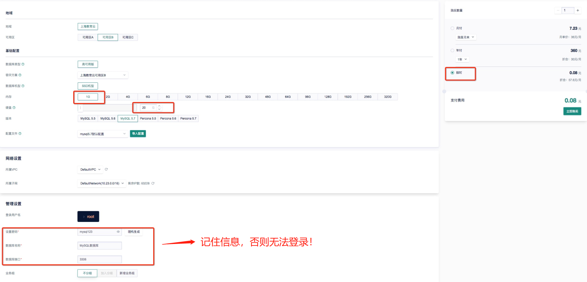
</kbd>

<kbd>
  
</kbd>

#### 4）登录数据库

##### 方法一：通过phpMyAdmin网页登录
<kbd>
  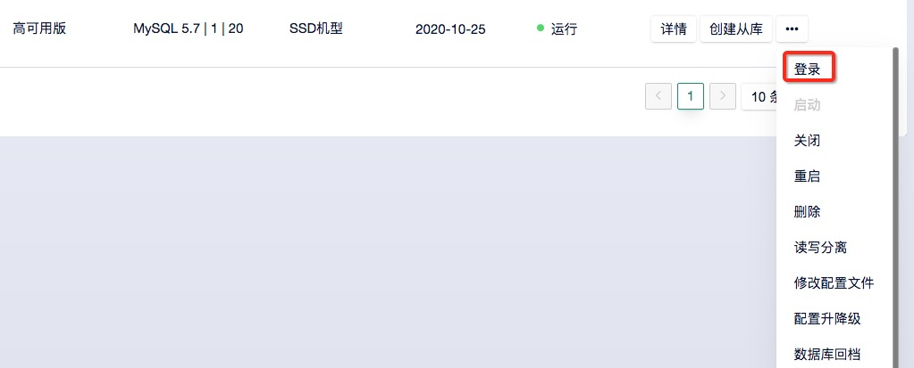
</kbd>

<kbd>
  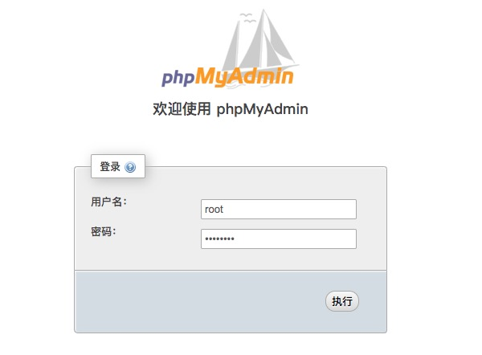
</kbd>

<kbd>
  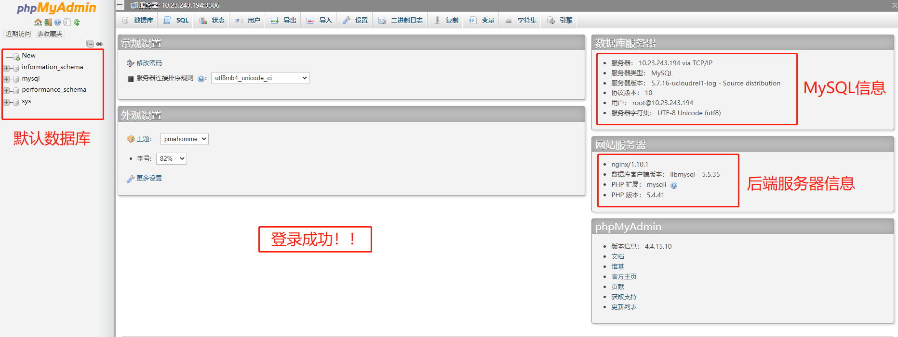
</kbd>

## `**************作业1：请将通过phpMyAdmin登录数据库的主页截图，并插入实验报告***************`


##### 方法二：通过云主机MySQL客户端，使用ip和端口登录（还记得怎么创建云主机吗 :dog:）

a）在云主机上安装MySQL客户端（root登录不需要加sudo）
```
sudo yum -y install mysql
```
<kbd>
  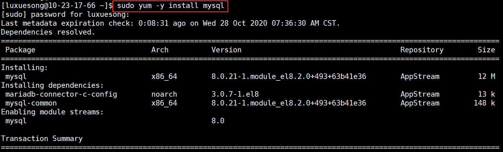
</kbd>

b）登录刚刚创建的数据库。其中，h表示host，即数据库的ip地址；P表示端口，数据库使用默认端口可省略；u表示登录数据库的username；p表示该username的登录密码
```
mysql -h$IP -P$Port -u$User -p$Password
```
<kbd>
  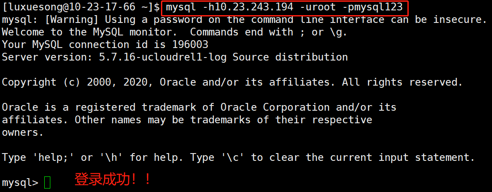
</kbd>

## `**************作业2：请将通过MySQL客户端登录数据库的画面截图（包含命令），并插入实验报告***************`


### 二）创建用户数据库，并建表（注：之前说的数据库是指数据库系统，这里说的数据库是指真正存储数据的逻辑库）

#### 1）创建一个airport数据库
<kbd>
  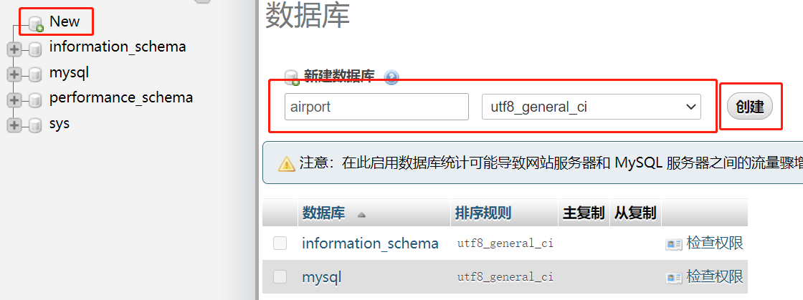
</kbd>

<kbd>
  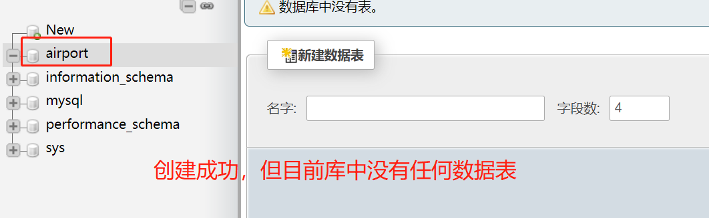
</kbd>

#### 2）让我们创建数据表shops和flights
<kbd>
  
</kbd>
<kbd>
  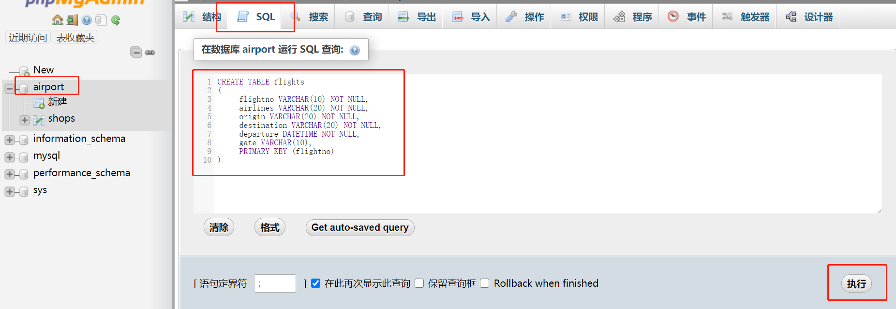
</kbd>
<kbd>
  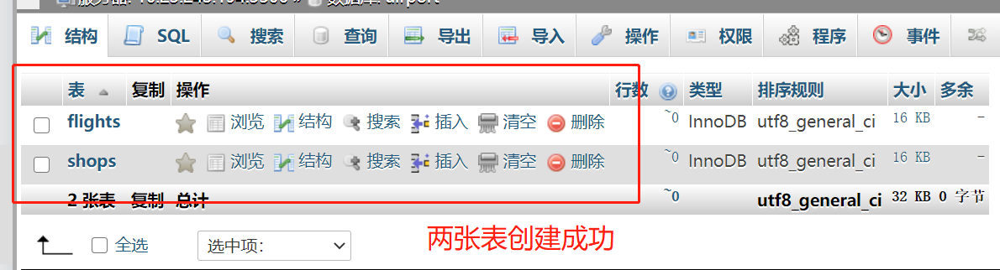
</kbd>


#### 3）在表中插入一些数据。在刚才建表的窗口执行以下SQL语句。
```
INSERT INTO shops
VALUES 
(1,'StarBucks','T1-203','2020-03-01'),
(2,'7-Eleven','T2-311','2020-05-22'),
(3,'Apple Store','T1-215','2020-06-14'),
(4,'Huawei Mobile','T3-222','2020-10-28');
```

```
INSERT INTO flights
VALUES 
('MU567','China Eastern','Shanghai','Singapore','2020-03-01 14:20','A52'),
('CA7209','Air China','Shanghai','San Francisco','2020-05-22 13:45','B12'),
('JL872','JAPAN AIRLINES','Shanghai','Tokyo','2020-09-15 09:00','A33');
```

> 看到类似如下页面，说明插入成功！

<kbd>
  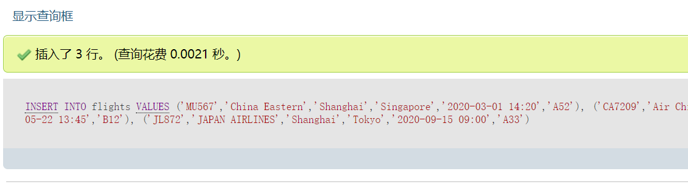
</kbd>

#### 4）看看我们的表中现在有什么吧 :yum:
```
SELECT * FROM shops;
```

```
SELECT * FROM flights;
```


## `**************作业3：请将执行 SELECT * FROM flights 语句后的页面截图，并插入实验报告***************`


### 三）使用Wordpress和MySQL数据库创建个人博客

> WordPress是一个以PHP和MySQL为平台的自由开源的博客软件和内容管理系统。WordPress具有插件架构和模板系统。截至2018年4月，排名前1000万的网站中超过30.6%使用WordPress。WordPress是最受欢迎的网站内容管理系统。全球有大约30%的网站(7亿5000个)都是使用WordPress架设网站的。(来源：[Wikipedia](https://zh.wikipedia.org/wiki/WordPress))

#### 1）启动docker服务，并从公共库pull wordpress的镜像
```
sudo docker pull wordpress
```
> root账户不需要加sudo，普通账户使用sudo权限操作docker前，需将username加入到docker组，例如 `sudo usermod -aG docker luxuesong`

> 忘记如何安装启动docker的同学请参考[实验二](http://106.75.225.141/xuesong/cloud-computing-course/blob/master/Assignment2.md)。

> 你也可以登录ucloud镜像库并下载wordpress镜像，速度会快很多

```
sudo docker pull cloud_computing/wordpress
```

<kbd>
  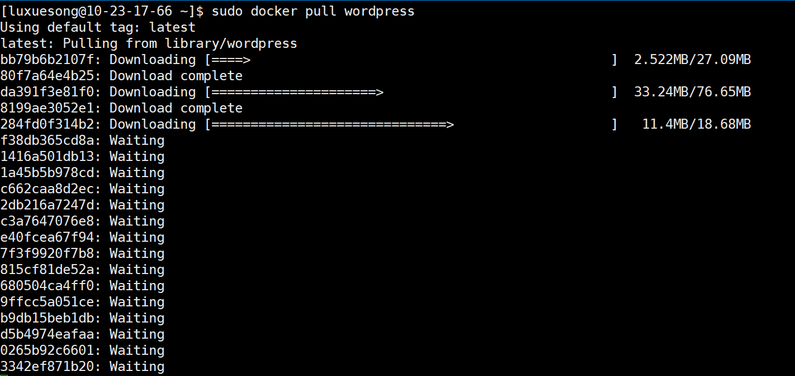
</kbd>

#### 2）运行wordpress的docker镜像，并将container的80和433端口暴露给云主机
```
sudo docker run --rm -d -p 80:80 -p 443:443 --name myWordpress -e WORDPRESS_DB_HOST=10.23.243.194:3306 -e WORDPRESS_DB_USER=root -e WORDPRESS_DB_PASSWORD=mysql123 wordpress
```

> 回顾docker run语法，--rm container停止运行时自动删除，-d 以Detached模式运行container，-p 80:80 将container的80端口映射到云主机的80端口，--name为container取名(myWordpress)，最后一个wordpress是镜像名。

> 这里遇到一个新的option -e，表示设置container的环境变量。因为我们要让wordpress网站连接MySQL数据库，所以要为container设置数据库相关的环境变量。

> WORDPRESS_DB_HOST是要连接的数据库ip和端口，WORDPRESS_DB_USER是数据库登录名，WORDPRESS_DB_PASSWORD是登陆密码，请设置为你的数据库信息。

<kbd>
  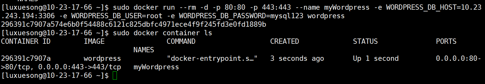
</kbd>

#### 3）个人博客已经运行，快去看看吧，http://你的云主机ip地址

> 首次登录需要配置一下

<kbd>
  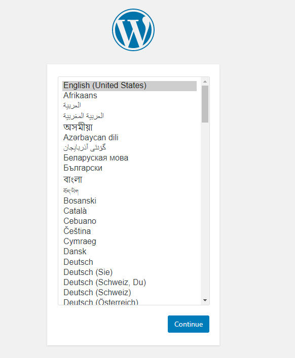
</kbd>
<kbd>
  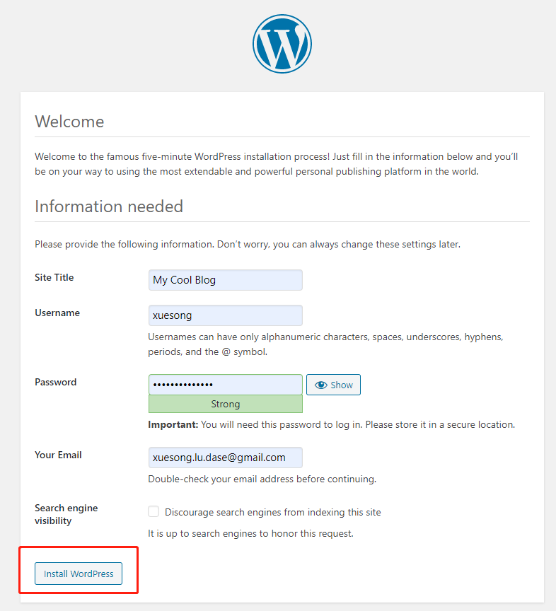
</kbd>

> 登录后进入dashboard，可以对你的博客网站进行定制。点击左上角你设定的网站名，可以进入博客主页（哇。。。界面属实有点拉垮）。

<kbd>
  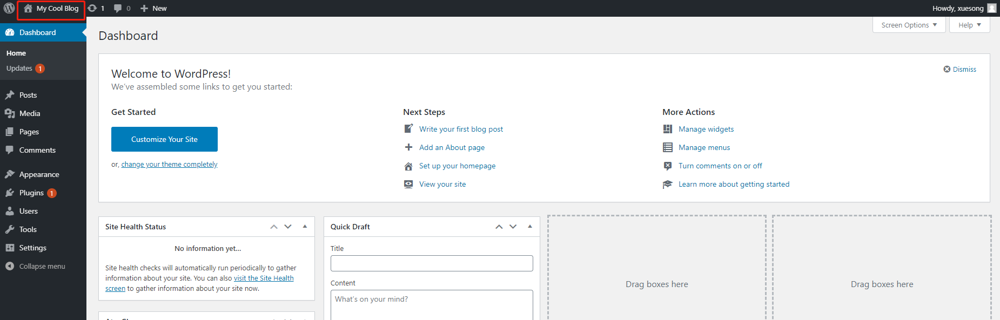
</kbd>

<kbd>
  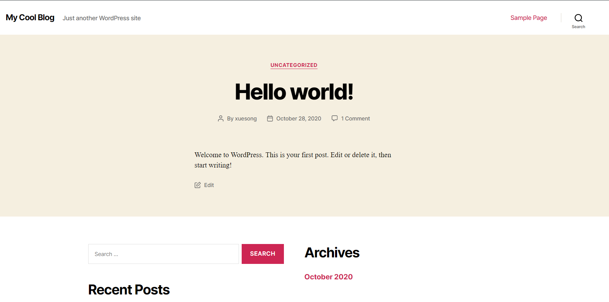
</kbd>

> 让我们换个主题场景，点击左上角dashboard，进入Appearance->Themes，选择Twenty Seventeen，并点击Activate，重新进入博客看看

<kbd>
  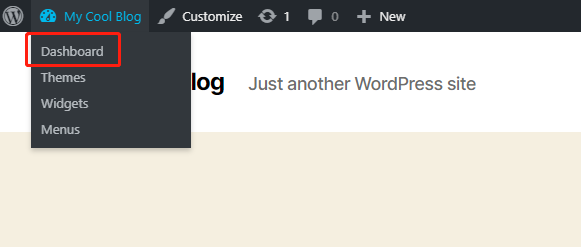
</kbd>
<kbd>
  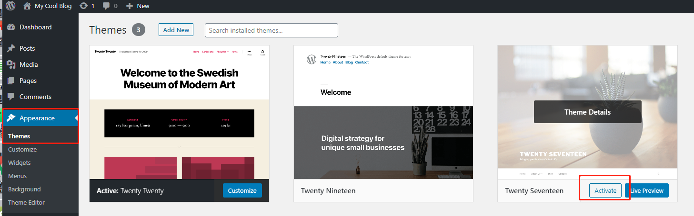
</kbd>

#### 4）让我们回过头看看数据库里面的变化

<kbd>
  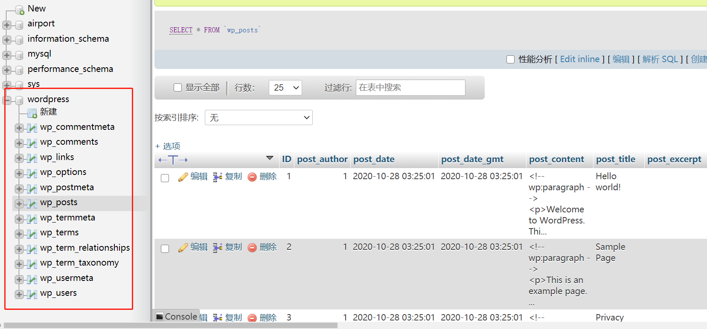
</kbd>

> wordpress自动创建了一个数据库，并添加了若干数据表，存储博客网站的数据

#### 5）最后，让我们写一个简单的博客吧

<kbd>
  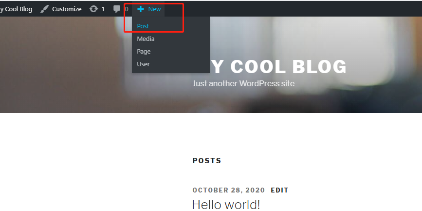
</kbd>

<kbd>
  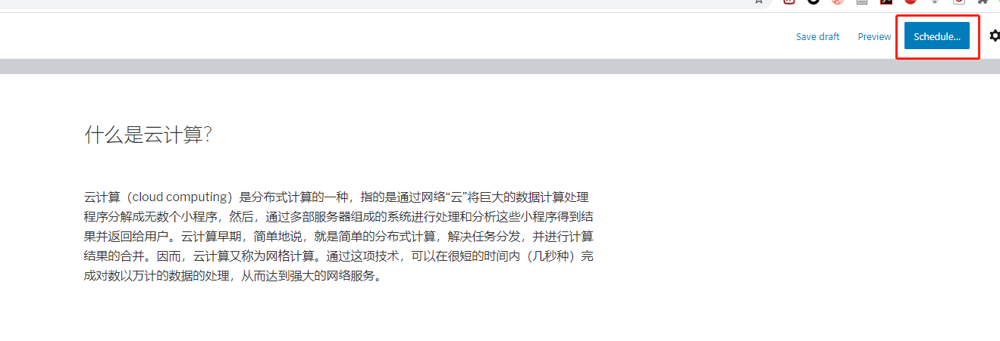
</kbd>

<kbd>
  
</kbd>

## `**************作业4：请任意写一个博客并发布（除了“什么是云计算”），截图博客并插入实验报告***************`
