# Assignment 5 指南

## `******注意，实验结束请立即删除云主机和数据仓库，节省费用******` 

## `******注意2，实验未结束且短期内不会继续实验，也请删除云主机和数据仓库。下次实验时重新创建******` 


##  实验内容

- 创建Greenplum数据仓库实例: `实验步骤 一)` 
- 登录数据仓库，并练习建表、插入、查找等基本操作：`实验步骤 二)`
- 使用MADlib完成简单的机器学习任务: `实验步骤  三)`

## 实验要求（仔细看）

- 完成所有步骤，并在实验报告（[模板下载](file/assignment5/学号-实验五.docx))中完成穿插在本指南中的作业1～作业4（只需要截图）。实验报告转成“学号-实验五.pdf”，并上传至http://113.31.104.68:3389/index.htm
- 实验报告上传deadline： `11月13日`

## 使用UCloud产品 

云数据仓库UDW、云主机uhost、私有网络vpc、基础网络unet

## 需要权限

云数据仓库UDW、云主机uhost、基础网络unet


## 基础知识（本实验详细知识会在数据仓库相关课程中学习，这里我们仅简单熟悉一下相关操作，你也可以去Google上Baidu一下相关知识 :ghost: :ghost: :ghost:）


`数据仓库:` data warehouse（缩写DW），是用于报告和数据分析的数据管理系统。

`和SQL数据库的区别:` 传统的关系型数据库（如实验四中的MySQL）主要应用于基本的、日常的事务处理（Transaction Processing），例如银行交易，淘宝购物，订购车票等。而数据仓库系统主要应用于生产数据的整理和分析（Analytical Processing），通过扩展数据分析和可视化等工具，支持业务决策，例如流量分析、用户画像、统计建模等。

举个简单例子，淘宝前端（网页端、app端）每天的交易事务，都是用关系型数据库支持的。而每天的交易数据，会定时导入到后端的数据仓库（俗称ETL，Extract, Transform, Load），并根据特定业务逻辑重新整理，从而方便后端各个团队分析数据和做出业务决策。

<kbd>
  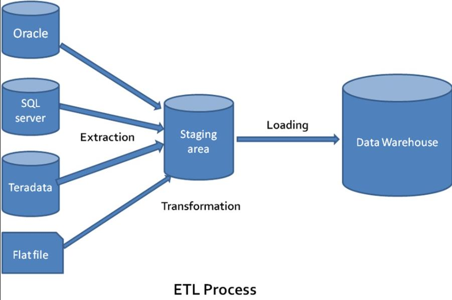
</kbd>


`UDW云数据仓库:` 是UCloud的DW产品，基于开源软件Greenplum（底层为PostgreSQL数据库）开发的大规模并发、完全托管的PB级数据仓库服务。支持MADlib、PostGIS等扩展工具，可以方便地支持机器学习、空间地理位置应用等数据分析任务。

`MADlib:` MADlib提供了一套基于SQL的机器学习、数据挖掘和统计算法，可以在数据库引擎内大规模运行。在Greenplum中安装了MADlib插件以后，可以直接在数据仓库内进行复杂计算和数据建模等工作。


闲话少说，我们开始创建一个UDW玩玩。:ghost: :ghost: :ghost:

## 实验步骤

### 一）创建Greenplum数据仓库实例

#### 1）在产品中选择云数据仓库UDW，然后点击新建数据仓库
<kbd>
  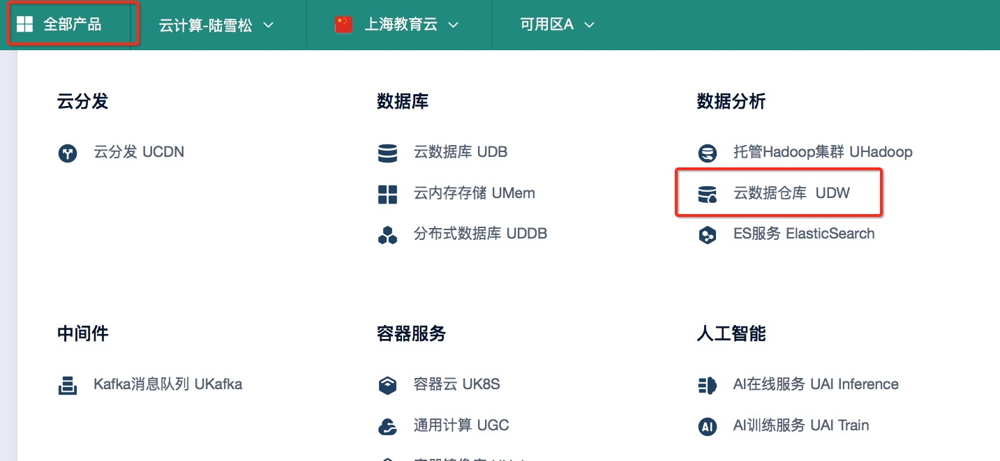
</kbd>

#### 2）使用默认配置，2个节点。将子网改成"DefaultNetwork"，记住DB名称，端口，管理员用户名，设置管理员密码。选择按时付费，立即购买。
<kbd>
  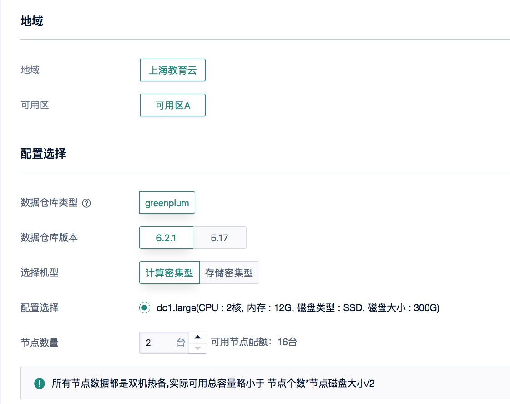
</kbd>

<kbd>
  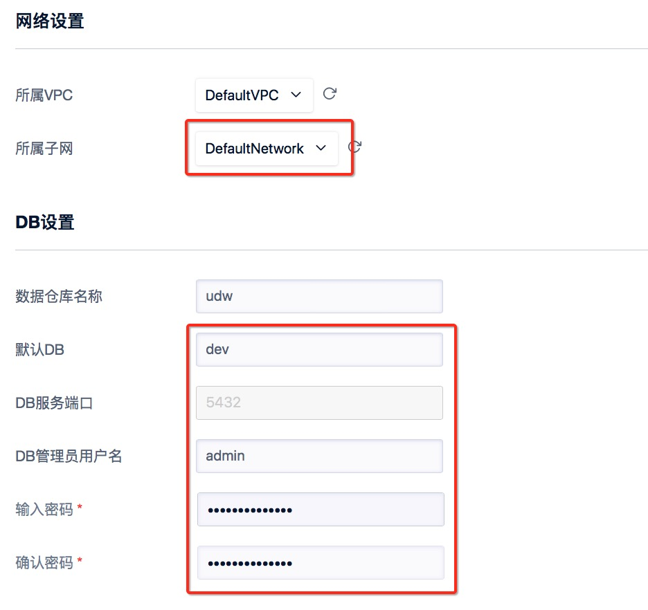
</kbd>

<kbd>
  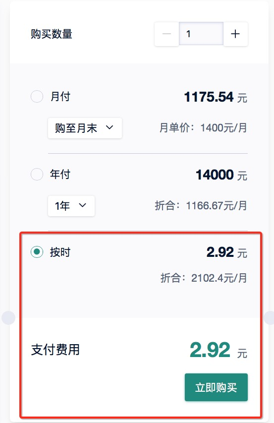
</kbd>

#### 3）支付之后，数仓创建时间从几分钟到十几分钟不等，等状态显示“运行中”，则创建完毕。记住数仓的IP地址。
<kbd>
  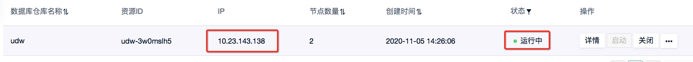
</kbd>

### 二）登录数据仓库。Greenplum数据仓库的登录有很多方式，比如用PostgreSQL客户端登录，用Greenplum客户端登录，用JDBC（在Java中使用）或者ODBC（在C/C++中使用）访问，用psycopg2（在Python中使用）访问。本实验我们完成PostgreSQL客户端和psycopg2两种方式。其余方式同学们以后可以自行尝试。

#### 1）使用PostgreSQL客户端登录。创建一个最低配置的Centos云主机，选择按流量计费，20M带宽，云主机按小时付费。登录以后运行以下命令，安装PostgreSQL客户端psql。
```
sudo yum install postgresql.x86_64 -y
```

##### 1.1）安装完毕后运行以下命令登录数据仓库。将相关参数替换成你的数据仓库参数。登录后将看到如下界面（我们已经在dev库中）。
```
psql -h hostIP –U username -d database -p port
```
<kbd>
  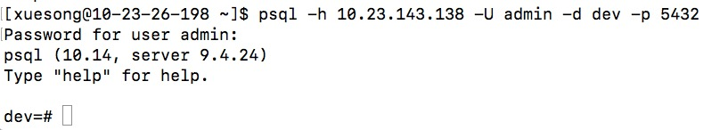
</kbd>

## `**************作业1：请将登录命令和登录成功界面截图，并插入实验报告***************`

##### 1.2）让我们运行几个SQL代码来实现建表，插入，查询等操作。
> 复制以下sql代码，并在psql中运行（注意要包含最后的分号）
```
CREATE TABLE regression (
   id int,
   y int,
   x1 int,
   x2 int
);
```

> 运行后我们看到如下notice，提示建表时没有使用`DISTRIBUTED BY`语句，因此Greenplum默认使用id作为分布键。这是因为greenplum是一个分布式数仓，数据会分布在不同的节点上，因此建表的时候要用`DISTRIBUTED BY`语句说明按照哪一个属性（即所谓“分布键”）对数据进行划分。由于我们没有指定，系统默认使用了第一列作为分布键。

<kbd>
  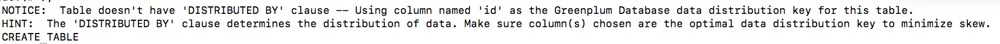
</kbd>


> 接着让我们在regression表中插入一些值
```
INSERT INTO regression VALUES 
   (1,  5, 2, 3),
   (2, 10, 7, 2),
   (3,  6, 4, 1),
   (4,  8, 3, 4);
```

> 让我们查询一下regression表中的数据。你应该看到如下输出。
```
SELECT * FROM regression;
```

<kbd>
  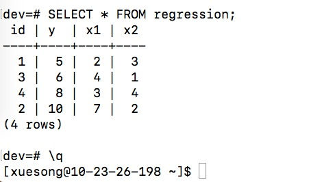
</kbd>

##### 1.3）运行\q退出psql客户端。

## `**************作业2：请如上图一样将regression表的查询命令、输出结果和退出psql以后的界面截图，并插入实验报告***************`


#### 2）使用`Python`+`psycopg2`访问。很多时候我们需要在程序中访问数据仓库，比如用Python读取DW中的数据，然后进一步操作。我们可以通过使用`psycopg2`来实现访问。运行以下命令安装`psycopg2`package。
```
sudo yum install python3-devel -y
sudo yum install postgresql-libs -y
sudo yum install postgresql-devel -y
sudo yum install gcc -y
pip3 install --user psycopg2
```

##### 2.1）安装完毕后运行python3，然后import psycopg2，若没有报错，则说明psycopg2安装成功。
<kbd>
  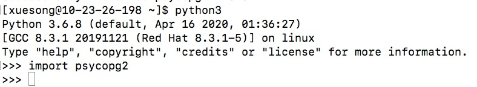
</kbd>

##### 2.2）quit()退出python3命令行，让我们运行几个Python代码来实现建表，插入，查询等操作。

> 建立createTable.py文件，并复制如下代码。其中username，password，hostIP，port都要替换成你的数据仓库参数。
```
import psycopg2
conn = psycopg2.connect(database="dev", user="username", password="password", host="hostIP", port="port")
cur = conn.cursor()
cur.execute('CREATE TABLE COMPANY (ID INT PRIMARY KEY   NOT NULL,\
                                   NAME TEXT            NOT NULL,\
                                   AGE                  INT     NOT NULL,\
                                   ADDRESS              CHAR(10),\
                                   SALARY               REAL);')
conn.commit()
conn.close()
```

> 运行createTable.py，如果没有报错，则说明建表成功。
```
python3 createTable.py
```

> 向COMPANY表中添加一些记录。建立insertTable.py文件，复制如下代码并运行。
```
import psycopg2
conn = psycopg2.connect(database="dev", user="username", password="password", host="hostIP", port="port")
cur = conn.cursor()
cur.execute("INSERT INTO COMPANY VALUES (1, 'Paul', 32, 'California', 20000.00 )");
cur.execute("INSERT INTO COMPANY VALUES (2, 'Allen', 25, 'Texas', 15000.00 )");
cur.execute("INSERT INTO COMPANY VALUES (3, 'Eric', 35, 'Florida', 25000.00 )");
conn.commit()
conn.close()
```

> 让我们查询一下刚刚建的表。建立selectTable.py文件，复制如下代码并运行。
```
import psycopg2
conn = psycopg2.connect(database="dev", user="username", password="password", host="hostIP", port="port")
cur = conn.cursor()
cur.execute("SELECT id, name, address, salary  from COMPANY order by id")
rows = cur.fetchall()
print ("ID      NAME      ADDRESS      SALARY")
for row in rows:
    print (row[0], "\t", row[1], "\t", row[2], "\t", row[3])
conn.close()
```

> 你应该会看到如下输出。

<kbd>
  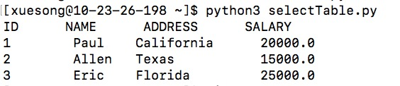
</kbd>

## `**************作业3：请将运行selectTable.py的命令和输出结果截图，并插入实验报告***************`


### 三）使用MADlib完成简单的机器学习任务（线性回归）

#### 1）前面我们说过，在Greenplum中使用MADlib插件可以直接在DW中建立机器学习模型。这里我们用二）中的regression表跑一下线性回归算法。请使用psql或者psycopg2登录数仓，并运行如下命令。

```
SELECT madlib.linregr_train (
   'regression',           -- source table
   'regression_model',     -- output model table
   'y',                    -- dependent variable 
   'ARRAY[1, x1, x2]'      -- independent variables
);
```

> 这里我们看到使用了MADlib的线性回归模型linregr_train来对regression表中的数据进行训练，模型输入变量为x1, x2以及偏置项，输出变量为y。训练好的模型保存在regression_model表中。

### 2）让我们看下模型表中有什么，运行以下命令

```
SELECT * FROM regression_model;
```

> 可能输出比较乱，你可以运行以下命令，让表的结果竖起来。

```
\x

SELECT * FROM regression_model;
```
> 这样是不是顺眼多了 :ghost: :ghost: :ghost: 我们看到了线性回归模型的参数以及标准差，p-value等指标的值

<kbd>
  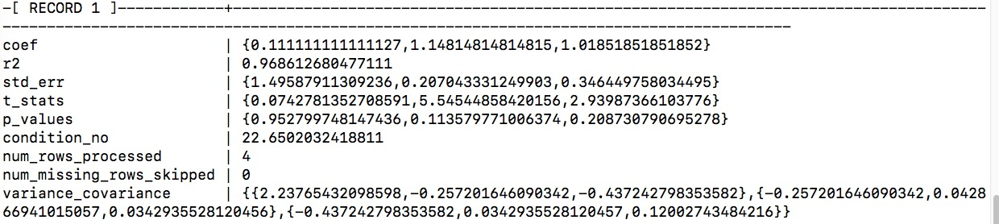
</kbd>

### 3）最后让我们用这个模型去做预测。我们直接在训练集上进行预测。你会看到如下输出，其中predict是预测结果，observation是原始的y值。
```
\x

SELECT regression.*, 
        madlib.linregr_predict ( ARRAY[1, x1, x2], m.coef ) as predict,
        y as observation
FROM regression, regression_model m;
```

<kbd>
  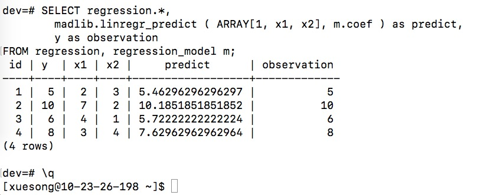
</kbd>

### 4）运行\q退出psql客户端。

## `**************作业4：请如上图一样把预测结果和退出psql以后的界面一起截图，并插入实验报告***************`
