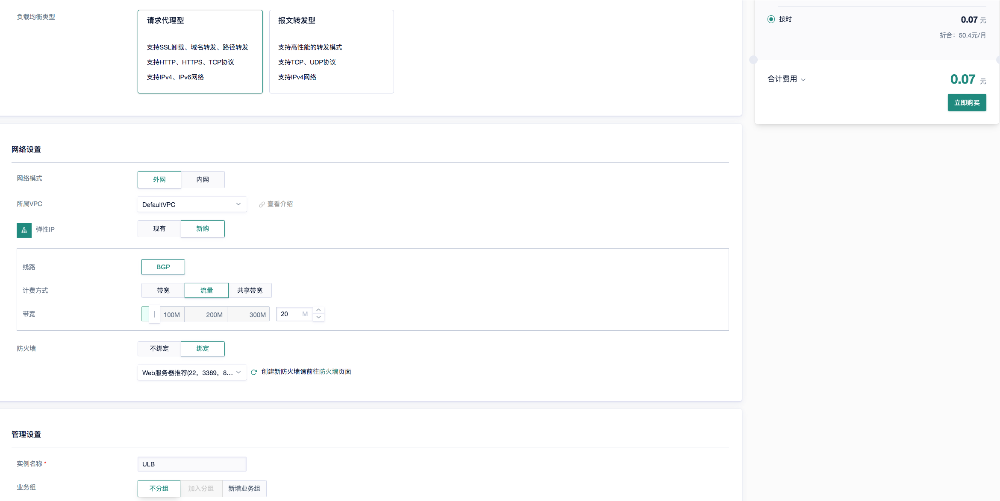
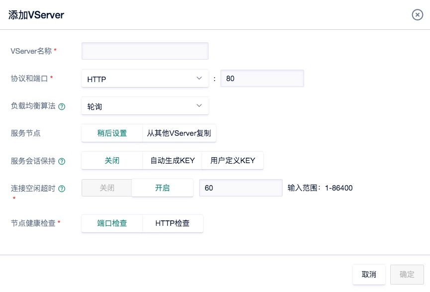
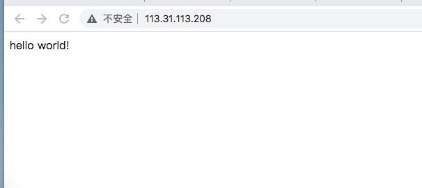
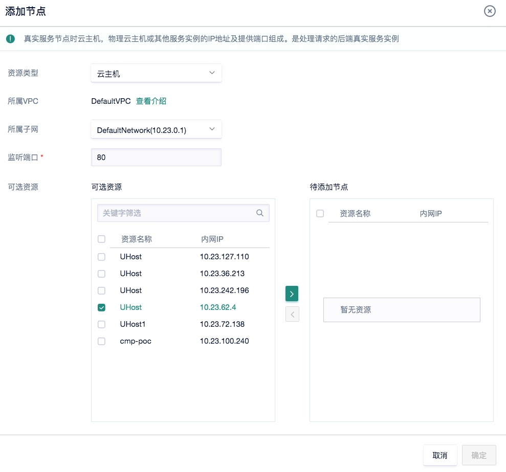
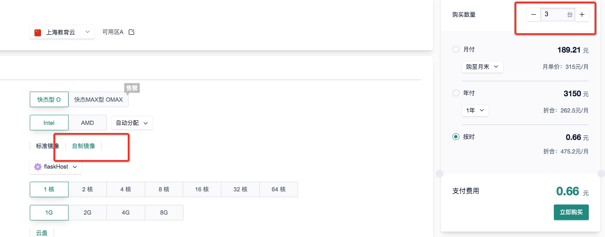
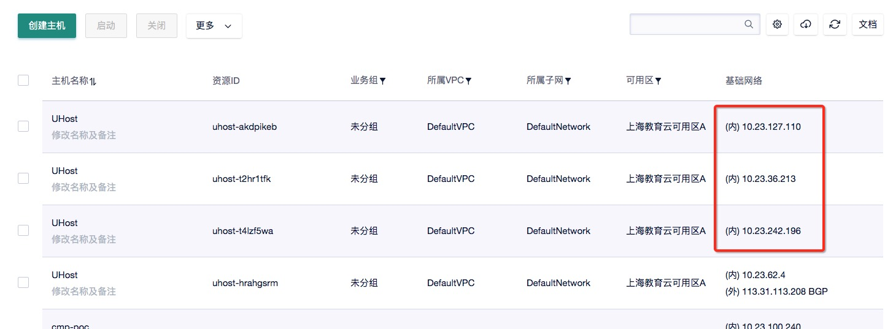
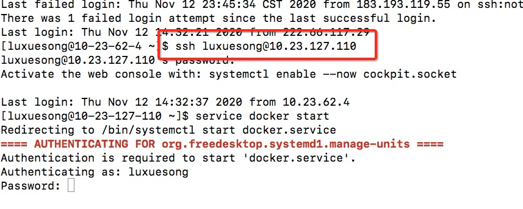
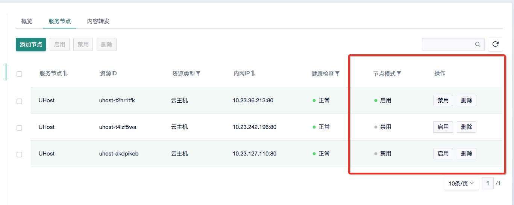

# Assignment 6 指南

## `******注意，实验结束请立即删除负载均衡器和所有云主机，节省费用******` 

## `******注意2，实验未结束且短期内不会继续实验，也请删除负载均衡器和所有云主机。下次实验时重新创建******` 

## `******提示：勤用保存镜像******`

##  实验内容

- 创建负载均衡器: `实验步骤 一)` 
- 创建Flask App服务实例，并连接负载均衡器：`实验步骤 二)`
- 进行服务器压力测试: `实验步骤  三)`

## 实验要求

- 完成所有步骤，并在实验报告（[模板下载](file/assignment6/学号-实验六.docx))中完成穿插在本指南中的作业1～作业4）。实验报告转成“学号-实验六.pdf”，并上传至http://113.31.104.68:3389/index.htm
- 实验报告上传deadline： `11月20日`

## 使用UCloud产品 

云主机UHost、负载均衡ULB、私有网络VPC、基础网络UNet

## 需要权限

云主机UHost、负载均衡ULB、基础网络UNet


## 基础知识


`负载均衡:` load balancing，是指将用户请求按照一定的规则，分流到提供相同服务的多个服务实例上，从而减轻单点服务器的压力，是保证服务高并发高可用的技术手段之一。用户、负载均衡器和服务器实例的关系可以简化为下图。这种架构的另一个好处是可以把服务器隐藏在局域网防火墙背后，因为外网直接访问的是负载均衡器。

<kbd>
  
</kbd>

负载均衡的算法有很多，常见的如轮询，ip地址哈希，最小连接数等，应对不同的需求，感兴趣的同学可以去了解一下。


`压力测试:` 测试一个系统的最大抗压能力，在强负载、高并发的情况下，测试系统所能承受的最大压力，预估系统的瓶颈。例如天猫双11之前，阿里内部会对整个淘宝平台进行全链路压测，预估应对峰值交易的能力。压力测试的工具有很多，今天我们练习使用非常简单的ApacheBench（ab）对http服务器进行压测。

好，废话少说，咱们书归正传！

## 实验步骤

### 一）使用ULB创建一个外网负载均衡器。

#### 1）在产品->网络中选择负载均衡ULB，然后点击创建负载均衡。

#### 2）根据下图配置，选择按时付费。因为我们一会需要从外网访问Flask App，所以选择外网负载均衡。

<kbd>
  
</kbd>

#### 3）创建完毕后，记住ULB的IP地址，点击详情->VServer管理->添加VServer。这里VServer就可以看成是一个负载均衡服务器，负责分流。取任意VServer名称，其他保持默认设置，点击确定。

<kbd>
  
</kbd>

#### 4）点击“服务节点”标签页，当前没有任何实际的节点提供服务。我们接下来创建一些服务节点。


### 二）使用云主机创建Flask App服务实例，并连接负载均衡器。

#### 1）创建一个1核1G的云主机，绑定弹性IP，选择web型防火墙，按时付费（已经很熟练了吧 :dog: :dog:）

#### 2）使用docker file创建一个Flask App的image（比如实验2中的hello world），并且暴露docker容器的5000端口（因为Flask开发模式默认端口就是5000）。创建完毕之后运行docker，将5000端口映射到云主机的80端口。

```
docker run -d --rm -p 80:5000 --name myflask luxuesong/myflaskapp
```

请同学们复习一下docker的安装和使用，以及通过dockerfile创建镜像。如果你意外保存了实验二的镜像，可以从镜像创建云主机，然后直接启动并docker run。

#### 3）打开浏览器，输入 `http://你的云主机外网ip`，测试app是否正常运行。正常则进入下一步。

<kbd>
  
</kbd>

#### 4）将云主机连到负载均衡器。回到前面添加服务节点的界面，输入端口80，则所有可添加的节点都会出现（以内网ip形式）。将你的云主机对应的内网ip，转移到待添加节点，点击确定。这时候显示健康检查“失败”，不用管它，我们在浏览器中输入 `http://你的负载均衡器ip`，奇迹发生了！我们也能访问flask app！！并且这时候健康检查也变成“正常”。

<kbd>
  
</kbd>


## `**************作业1：请将浏览器中通过负载均衡ip访问flask app的界面，以及负载均衡器中服务节点界面截图，并插入实验报告***************`

#### 5）此时负载均衡器只连接了一个服务实例，等同于单机访问。`为步骤三做准备，请在这一步制作当前云主机的镜像`。


### 三）使用ab进行http服务器压力测试

#### 1）使用步骤二）中制作的镜像，创建三个最低配置的云主机（`和之前一样，只是在云主机创建界面用“自制镜像”，并且不需要弹性ip`），可以选择三台主机一次性创建

<kbd>
  
</kbd>

#### 2）创建完毕后，使用有外网ip的那台云主机，逐个ssh到三台内网机器上（通过内网ip），然后每台机器直接启动docker服务，并运行flask app容器（因为已经全都安装并且build好了 :smiley_cat: :smiley_cat: :smiley_cat:）

<kbd>
  
</kbd>

<kbd>
  
</kbd>

#### 3）现在让我们把这三个云主机连接到负载均衡器，并且从负载均衡器中删除刚才的具有外网ip的节点（接下来我们要用外网ip节点做压测）。首先我们禁用掉其中的两个节点，只保留一个节点在启用状态。如下图所示。

<kbd>
  
</kbd>

## `**************作业2：请将此时连接到负载均衡的服务节点（三个）截图，并插入实验报告***************`

#### 4）登录具有外网ip的云主机，安装ApacheBench
```
sudo yum -y install httpd
```

#### 5）运行压测命令。`-c`表示并发数，即同时发生的请求数，`-n`表示请求总数，`http://106.75.216.169/`替换成你的负载均衡器ip。所以这里对我们的flask app并发1000个请求，总共发出10000个请求。结果如下图所示。
```
ab -c 1000 -n 10000 http://106.75.216.169/
```

<kbd>
  
</kbd>

> 这里我们关注几个重要结果

> 1) Time taken for tests：压测总时间

> 2) Requests per second: 平均每秒处理请求数

> 3) Time per request: 平均每个请求处理时间

#### 6）接下来，请逐渐启用第2和第3个服务器节点，然后再运行上面的压测命令。

## `**************作业3：请将启用一个节点、两个节点、三个节点时的压测结果分别截图，并插入实验报告***************`

注意，由于有网络因素干扰，每个实验你可以多进行几次压测，得到比较正常的结果再截图。

## `**************作业4：假设现在压测结果显示单台机器的Requests per second为30，一天中的请求峰值时间是2个小时，峰值期间总共需要处理5千万个请求，请问需要至少准备多少台机器才可能平稳度过峰值请求？***************`
