# Assignment 7 指南

## `******注意，实验结束请立即删除云主机、UFS文件存储和UAI Train交互式训练任务，节省费用******` 

## `******注意2，实验未结束且短期内不会继续实验，也请删除所有上述资源。下次实验时重新创建******` 


##  实验内容

- 创建文件存储: `实验步骤 一)` 
- 创建云主机，并挂载文件存储：`实验步骤 二)`
- 在水杉码园创建一个仓库，并下载至文件存储：`实验步骤 三)`
- 创建UAI Train交互式训练任务，启动并切换成编辑模式: `实验步骤  四)`
- 使用交互式训练任务训练一个能够识别MNIST手写数字的神经网络，并将所有内容同步到水杉码园：`实验步骤 五)`

## 实验要求

- 完成所有步骤，并在实验报告（[模板下载](file/assignment7/学号-实验七.docx))中完成穿插在本指南中的作业1～作业5）。实验报告转成“学号-实验七.pdf”，并上传至http://113.31.104.68:3389/index.htm
- 实验报告上传deadline： `12月4日`

## 使用UCloud产品 

云主机UHost、文件存储UFS、镜像库UHub、AI训练UAI Train、私有网络VPC、基础网络UNet

## 需要权限

云主机UHost、文件存储UFS、镜像库UHub、AI训练UAI Train、基础网络UNet


## 基础知识


`MNIST:` MNIST是一个手写数字数据库，包含60000个训练样本和10000个测试样本，是一个能够快速上手的、用于尝试机器学习和模式识别技术的数据集。以下是部分MNIST中的样本。

<kbd>
  
</kbd>


## 实验步骤

### 一）创建一个文件存储

#### 1）在产品->存储中选择“文件存储UFS”，然后点击创建文件系统。

#### 2）如下图，存储类型选择SSD性能型，100GB，按时付费。

<kbd>
  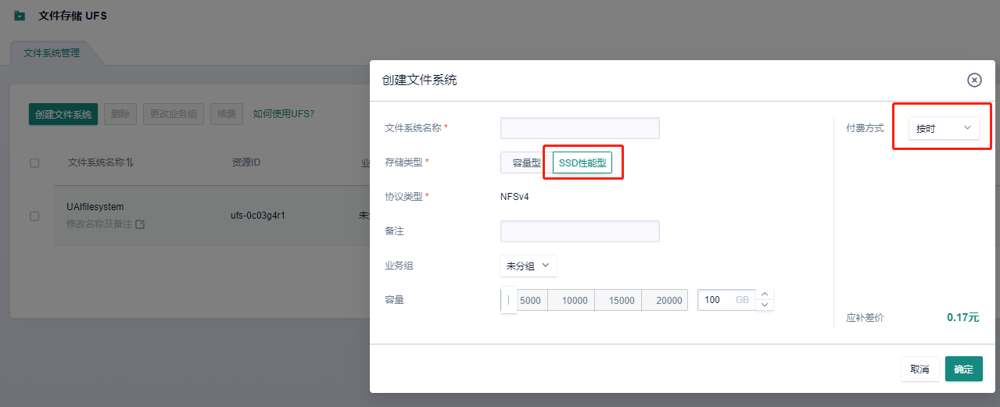
</kbd>

#### 3）创建完毕后，点击添加挂载点，如下图所示选择一个VPC网络，使得相应的子网是DefaultNetwork，点击确定。这样我们等一下在DefaultNetwork下面创建一个云主机，就能把这个文件存储挂载到云主机上。

<kbd>
  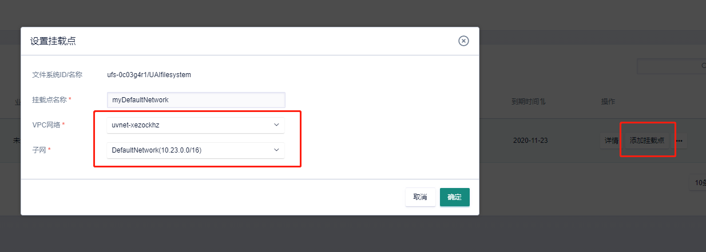
</kbd>

#### 4）点击“管理挂载”，查看挂载信息，记住文件存储所在的ip地址，第二）步中我们把这个文件存储挂载到云主机上。

<kbd>
  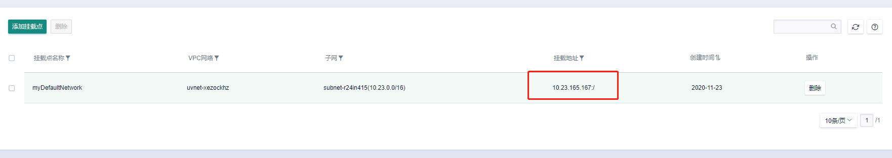
</kbd>


## `**************作业1：请将含有文件存储ip地址信息的页面截图，并插入实验报告***************`


### 二）将文件存储挂载到云主机上，使得它在逻辑上成为云主机的一个分区

#### 1）创建一个1核1G的云主机，绑定弹性IP，按时付费（这个云主机必须在文件存储所挂载的子网中，否则无法和文件存储通信）

#### 2）登录云主机，安装NFS

```
sudo yum install -y nfs-utils
```

NFS（Network File System）是一个能够使得本地主机访问远程主机文件系统的应用程序。因为步骤一）创建的文件存储对于当前的云主机来讲是一个远程存储（网络存储），使用NFS协议才能将其挂载到当前云主机上。

#### 3）在云主机上挂载文件存储，挂载点为/mnt

```
sudo mount -t nfs4 你的文件存储IP地址:/ /mnt
```

#### 4）运行如下命令查看当前云主机的文件系统

```
df -hT
```

你应该看到如下图所示内容

<kbd>
  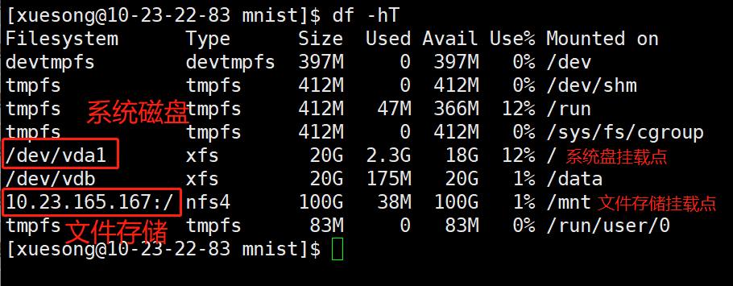
</kbd>


## `**************作业2：请将df -hT的运行后界面截图，并插入实验报告***************`


### 三）在水杉码园创建一个仓库，并下载至文件存储

#### 1）登录[水杉在线](https://www.shuishan.net.cn/)，并从水杉在线门户进入“水杉码园”。创建一个仓库mnist（你也可以用其他命名，但后续操作请做相应修改），创建完毕后，找到你的仓库ssh地址，备用

<kbd>
  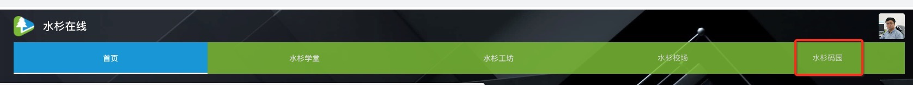
</kbd>

<kbd>
  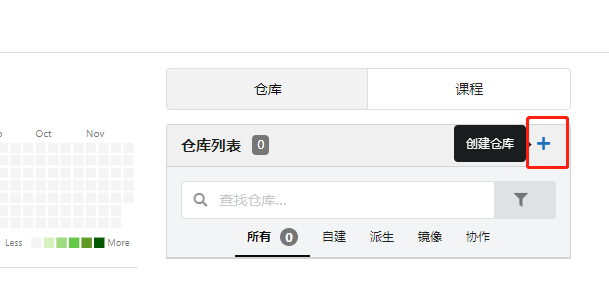
</kbd>
<kbd>
  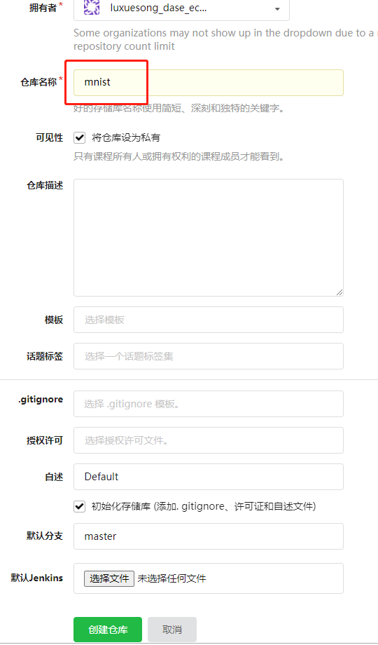
</kbd>
<kbd>
  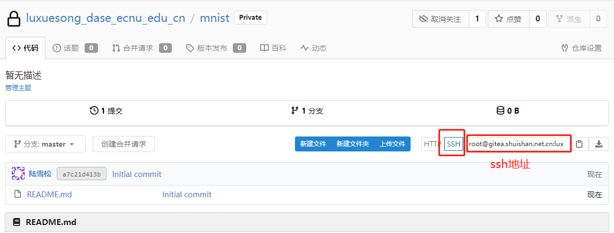
</kbd>

#### 2）在云主机上安装git，并配置一下

```
sudo yum install -y git
git config --global user.name "陆雪松"
git config --global user.email "xuesong.lu.dase@gmail.com"
```

#### 3）生成云主机密钥，使用密钥访问水杉码园

```
ssh-keygen
```
不用在提示符中输入任何内容，连摁回车，密钥即生成。可以在~/.ssh/下看到你生成的两个密钥，id_rsa是私钥，id_rsa.pub是公钥。如果你使用root账号，密钥在/root/.ssh/目录下。接下来我们要把公钥给码园，以后从这台云主机访问码园，云主机会把私钥提供给码园进行身份验证。

#### 4）打印并复制公钥的内容

```
cat ~/.ssh/id_rsa.pub
```

复制屏幕上出现的公钥内容

#### 5）在码园中创建公钥，并粘贴上述公钥内容

<kbd>
  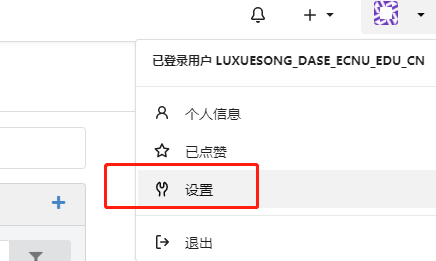
</kbd>
<kbd>
  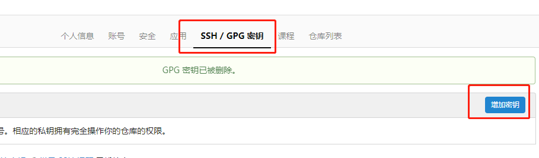
</kbd>
<kbd>
  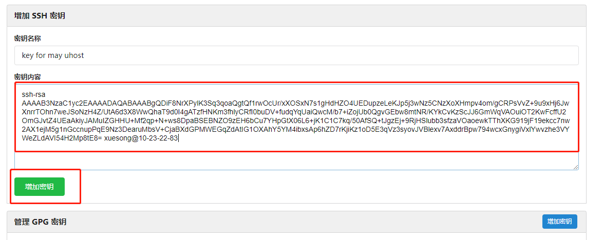
</kbd>


#### 6）在云主机上运行如下命令，取消码园密码访问

```
eval 'ssh-agent -s'
exec ssh-agent bash
ssh-add ~/.ssh/id_rsa
ssh -T root@gitea.shuishan.net.cn
```

如果你看到类似如下输出，说明密钥访问设置成功

<kbd>
  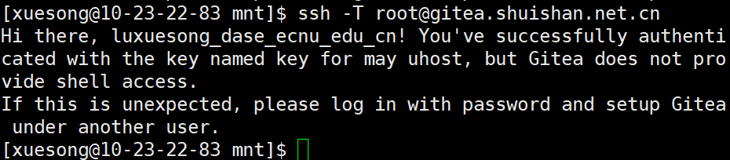
</kbd>

#### 7）将mnist仓库下载到文件储存

```
cd /mnt
sudo mkdir mnist
sudo chown xuesong:xuesong mnist   //更改mnist文件夹拥有者（即你的云主机登录账号）。假如你使用root账号，这步不需要
cd mnist
git init
git pull root@gitea.shuishan.net.cn:luxuesong_dase_ecnu_edu_cn/mnist.git   //将pull后面的内容替换成你仓库的ssh地址
```

#### 8）在mnist下面新建三个目录code，data，output，下一个步骤中会使用。创建完毕后，你的mnist文件夹应该有如下结构。

<kbd>
  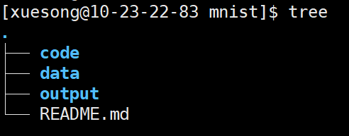
</kbd>

在步骤四）和五）中，我们将代码放在code文件夹中，数据放在data中，模型放在output中


## `**************作业3：请在mnist目录下运行ls -la命令并截图，插入实验报告***************`


### 四）创建UAI Train交互式训练任务，并切换成`编辑模式` （重要！！）

#### 1）在UCloud产品中人工智能分类下面，选择"AI训练服务 UAI Train"，点击“交互式训练”选项卡->创建交互式训练任务

#### 2）任务命名随意，在执行信息里面，输入Ucloud账号的公钥和私钥（右上角“API密钥”），代码镜像路径为默认，其余路径均选择UFS，然后如下图所示配置

<kbd>
  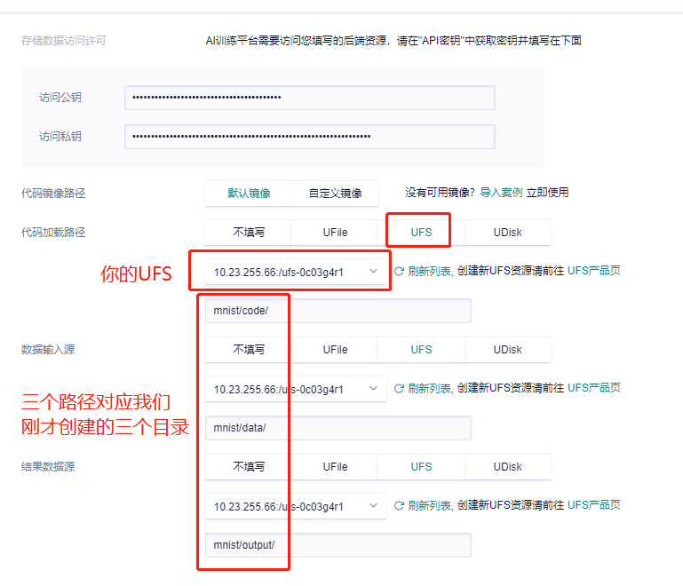
</kbd>

> 简要说明一下交互式训练的工作原理：启动任务的时候，UAI Train会运行一个docker容器，可以是UCloud的默认镜像，也可以是你自己创建的镜像，默认镜像已经安装了python，pytorch，tensorflow等等工具。我们配置的上述UFS路径，UAI Train会将他们映射到容器的/data目录下。也就是说，mnist/data会映射到容器的/data/data目录，mnist/code会映射到容器的/data/code目录。接下来我们便可以在容器中访问这些路径，运行代码。

#### 3）配置完毕，创建任务，等状态变成“执行中”，说明创建成功。

<kbd>
  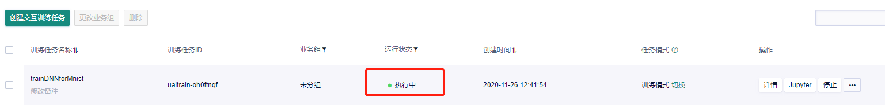
</kbd>

#### 4）这一步非常重要！！创建成功后，立即将任务模式从“训练模式”切换成`编辑模式`。

> 点击“切换”

<kbd>
  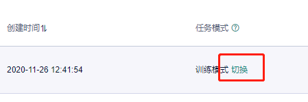
</kbd>

> 选择一个镜像库，填入要保存的镜像名。如果你的项目中还没有镜像库，则新建一个镜像库。

<kbd>
  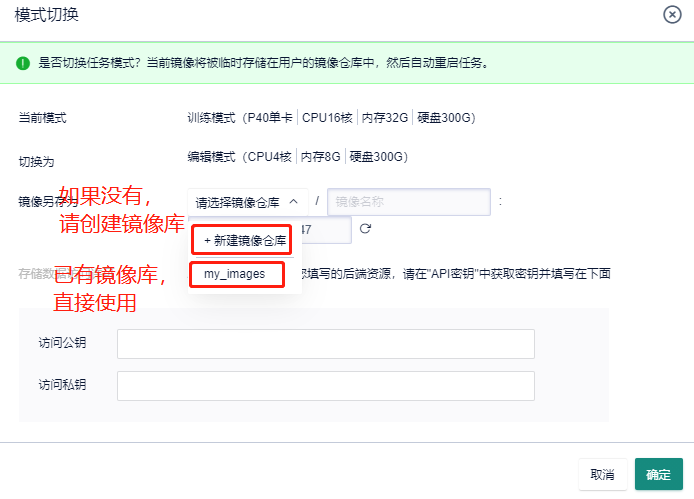
</kbd>

> 填入公钥和私钥，点击“确定”

<kbd>
  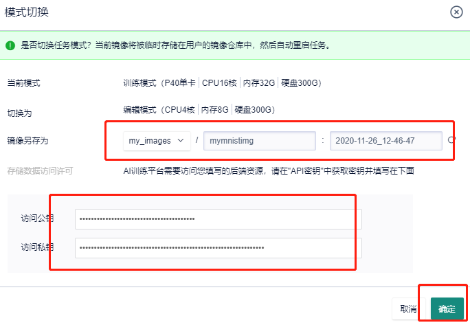
</kbd>

> 等待几分钟，等运行状态重新变成“执行中”，说明切换成功。这时候任务模式已经是“编辑模式”。

<kbd>
  
</kbd>

说明：这么做的原因只有一个，训练模式跑的是GPU，太烧钱 :joy: :joy: ！！
写代码时是不需要GPU的，所以切换到编辑模式，跑在CPU机器上；当代码完成，需要大规模训练的时候，才使用训练模式。

## 本实验不需要用到GPU，请确保一直在编辑模式下完成实验！！并且，实验暂停时，请点击“停止”暂停任务，这样便不会收费

<kbd>
  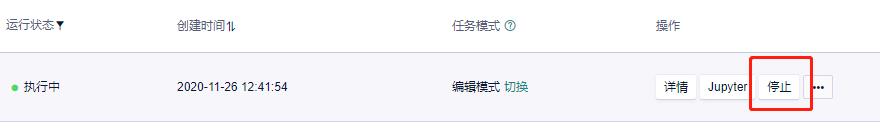
</kbd>


## `**************作业4：请将编辑模式页面截图，插入实验报告***************`


### 五）使用交互式训练任务训练MNIST识别模型，最后将所有内容同步到水杉码园

#### 1）点击训练任务的“Jupyter”按钮，进入jupyter notebook，我们看到了文件存储上的三个文件夹code，data和output，因为我们将它们映射到了容器中。

<kbd>
  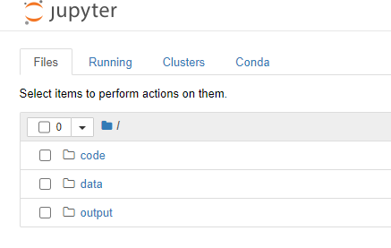
</kbd>

#### 2）点击进入code，新建一个tensorflow的notebook，并重命名为mnist，然后保存文件

<kbd>
  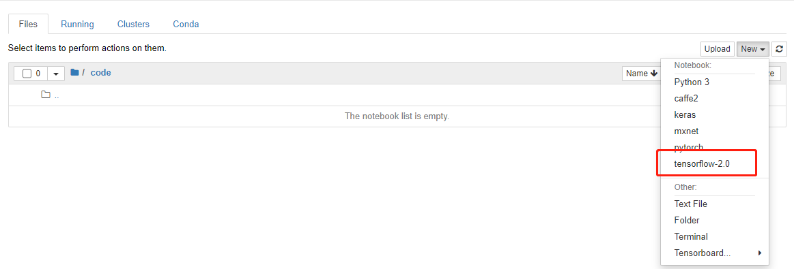
</kbd>

<kbd>
  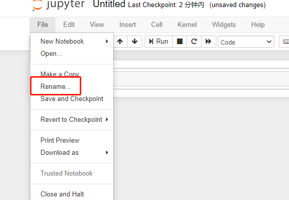
</kbd>

#### 3）回到云主机，进入/mnt/mnist/data目录，下载mnist数据集。完成后你的mnist目录结构应该如下图所示（output中可能略有不同）

```
wget https://storage.googleapis.com/tensorflow/tf-keras-datasets/mnist.npz
```

<kbd>
  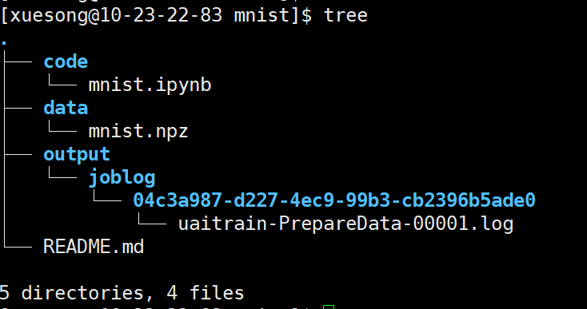
</kbd>

#### 4）此时让我们先把这些文件push一把，同步到码园中。在/mnt/mnist下，运行

```
git remote add origin root@gitea.shuishan.net.cn:luxuesong_dase_ecnu_edu_cn/mnist.git   //替换成你的码园仓库
git add .
git commit -m "xuesong's first commit"
git push origin master
```

没有报错则成功push，去水杉码园查看你的仓库验证。

#### 5）下载mnist训练代码[mnist.py](file/assignment7/mnist.py)，并在刚刚创建的mnist.ipynb中验证、训练一个模型。


## `**************作业5：上述代码训练的模型，在测试集上精度较低（如下图），请把测试集上的精度提升到95%以上（即运行model.evaluate(x_test,  y_test)后，accurray在95%以上），将运行结果截图并插入实验报告***************`

<kbd>
  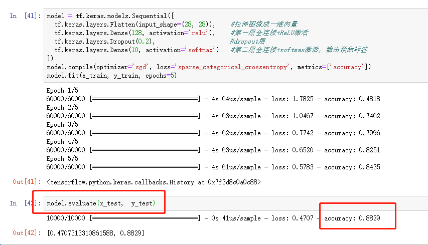
</kbd>


> 提示：你可以尝试增加epoch，也可以尝试更换优化器，其他优化器有Adagrad, RMSprop, Adam等


#### 6）保存训练代码，并push到水杉码园中。

```
git add .
git commit -m "commit source code and model"
git push origin master
```
