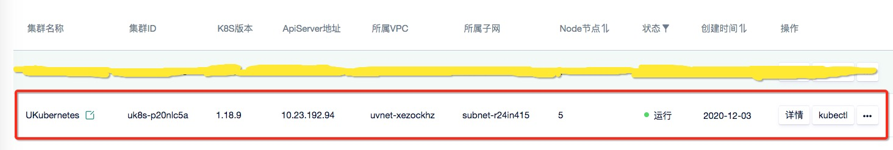
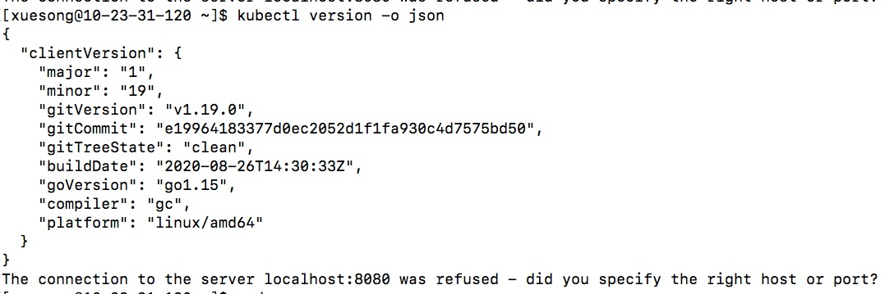
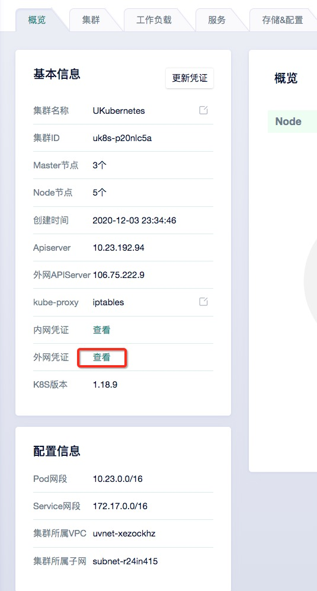
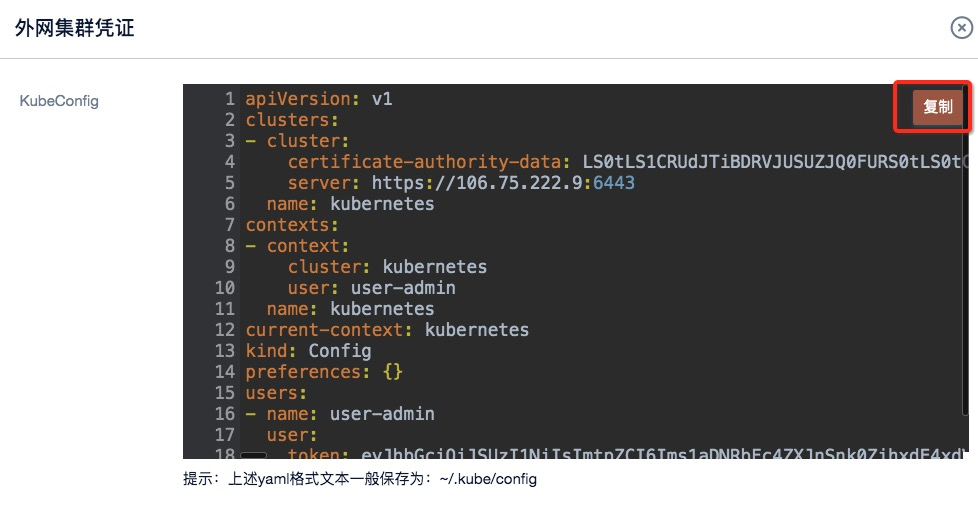
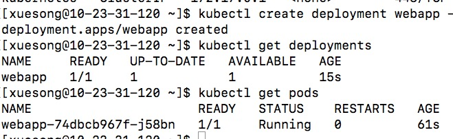
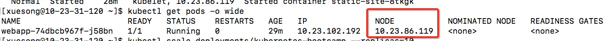
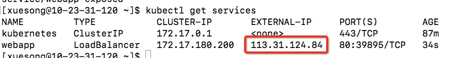
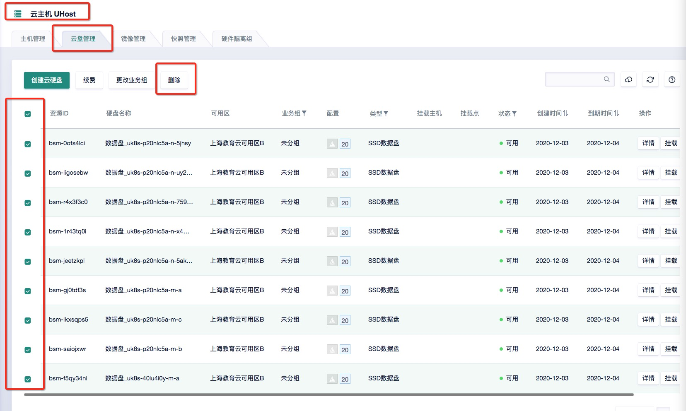
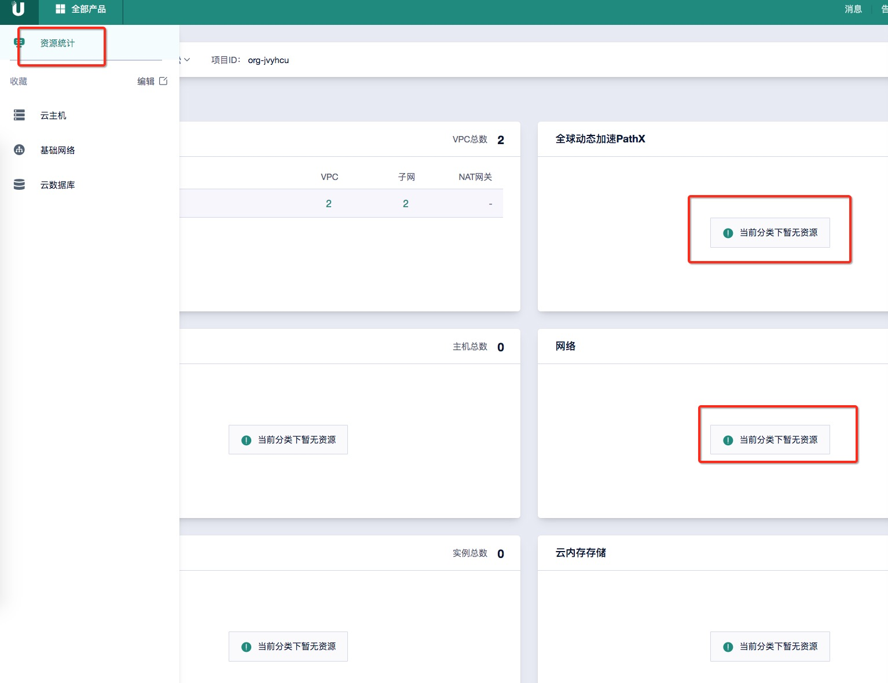

# Assignment 8 指南

## `******注意，实验结束请立即删除云主机UHost，云盘，负载均衡ULB和容器云UK8S集群，节省费用******` 

## `******注意2，实验未结束且短期内不会继续实验，也请删除上述所有资源。下次实验时重新创建******` 


##  实验内容

- 创建一个K8S集群: `实验步骤 一)` 
- 创建一个云主机，并安装kubectl：`实验步骤 二)`
- 在K8S集群上部署一个网页应用：`实验步骤 三)`
- 创建网页应用的多个副本：`实验步骤 四)`
- 启动一个Service对外提供服务：`实验步骤 五)`


## 实验要求

- 完成所有步骤，并在实验报告（[模板下载](file/assignment8/学号-实验八.docx))中完成穿插在本指南中的作业1～作业5）。实验报告转成“学号-实验八.pdf”，并上传至http://113.31.104.68:3389/index.htm
- 实验报告上传deadline： `12月11日`

## 使用UCloud产品 

云主机UHost、容器云UK8S、私有网络VPC

## 需要权限

云主机UHost、镜像库UHub、负载均衡ULB、容器云UK8S、基础网络UNet


## 基础知识


`K8S理论:` 请参考 https://www.yuque.com/serviceup/cloud-native-talks/k8s-roadmap-primary

`K8S实训:` 更多内容请参考 https://kubernetes.io/docs/tutorials/


## 实验步骤

### 一）创建一个K8S集群

#### 1）在产品->容器服务中选择“容器云UK8S”，然后点击“创建集群”。

#### 2）无需更改任何配置，设置管理员密码，付费方式改成“按时”（合计费用应为3.49元），点击立即购买->确认支付。

#### 3）这时候你可以吃早饭或者喝杯 :coffee:，等待5~10分钟

#### 4）当集群状态变成“运行”，说明创建完毕。

<kbd>
  
</kbd>

#### 5）让我们看看集群里有些什么。点击“详情”->“集群”，可以看到集群里创建了8个节点（云主机），3个master，5个node。再从控制台进入云主机产品界面，你会发现里面创建了8个云主机，对应的就是集群中的8个节点，每个云主机以“uk8s-”开头命名


## `**************作业1：请将K8S“集群”页面截图，并插入实验报告***************`


### 二）创建一个云主机，并安装kubectl（操作kubernetes集群的命令行工具）

#### 1）创建一个1核1G的云主机，绑定弹性IP，按时付费

#### 2）登录云主机，安装kubectl

```
wget https://storage.googleapis.com/kubernetes-release/release/v1.19.0/bin/linux/amd64/kubectl
chmod +x kubectl
sudo mv kubectl /usr/local/bin/   (root用户：mv kubectl /usr/bin/)
kubectl version -o json
```

#### 3）如果你看到如下输出说明安装成功

<kbd>
  
</kbd>


#### 4）将K8S的集群凭证添加到kubectl配置文件中，从而能够操控集群。

> 在概览中查看“外网凭证”，并复制凭证内容。

<kbd>
  
</kbd>

<kbd>
  
</kbd>

> 在云主机中创建~/.kube文件夹，然后创建~/.kube/config文件，并将凭证内容粘贴到该文件中。


#### 5）再次运行`kubectl version -o json`，可以看到除了刚才的client信息，server信息也能打印了。


## `**************作业2：请将到这一步的kubectl version -o json输出信息页面截图，并插入实验报告***************`


#### 6）尝试几个基本命令

```
kubectl cluster-info            //打印集群信息
kubectl get nodes               //打印节点信息
kubectl get pods                //打印pod信息
kubectl get deployments         //打印应用部署信息
kubectl get services            //打印service信息
```


### 三）在K8S上部署一个应用

#### 1）运行以下命令，部署一个assignment2中的静态网页app

```
kubectl create deployment webapp --image=uhub-edu.service.ucloud.cn/cloud_computing/static_site
```

> webapp是deployment的名字，可以随意。也就是说，我们创建了一个webapp部署，部署的内容是包含一个静态网页的docker；部署过程中打包了一个pod，包含了该应用


#### 2）用上面提到的基本命令查看应用部署信息和pod信息，得到如下图所示信息

<kbd>
  
</kbd>

#### 3）这时我们需要用kubectl创建一个代理，使得从云主机可以访问集群（从而访问pod）。打开一个新的Terminal或者XShell窗口，登录云主机。

```
echo -e "\n\e[92mStarting Proxy. After starting it will not output a response. Please click the first Terminal Tab\n"; kubectl proxy
```

> 你应该看到“Starting to serve on 127.0.0.1:8001”，表示代理设置成功


#### 4）访问webapp应用（访问pod）

```
export POD_NAME=$(kubectl get pods -o go-template --template '{{range .items}}{{.metadata.name}}{{"\n}}{{end}}')
echo Name of the Pod: $POD_NAME     //如果这一步没有输出，说明$POD_NAME没有获得pod名称，可以把kubectl get pods得到的pod名字直接赋给$POD_NAME。
curl http://localhost:8001/api/v1/namespaces/default/pods/$POD_NAME/proxy/
```

> 可以看到网页的html输出，说明应用部署成功

## `**************作业3：请将上面最后一个命令输出的信息截图，并插入实验报告***************`


### 四）创建多个webapp副本

#### 1）查看pod当前副本信息

```
kubectl get rs
```

> 可以看到只有一个副本，也就是之前我们手动部署的那个


#### 2）查看pod的详细信息

```
kubectl get pods -o wide
```

> 可以看到pod部署的NODE的ip信息，正是集群中的一个node。k8s自动选择了这个node进行部署。

<kbd>
  
</kbd>


#### 3）现在让我们用一行命令将副本scale到10个，然后再次查看pod详细信息

```
kubectl scale deployments/webapp --replicas=10
kubectl get pods -o wide
```

> 可以看到此时有10个运行webapp的pod，运行在集群中的4个node节点上（为什么不是5个？答案最后揭晓）

## `**************作业4：请将上述有10个pod的打印信息截图，并插入实验报告***************`


### 五）最后，让我们将webapp暴露给公网，从而可以从外部访问页面

#### 1）创建一个负载均衡service，将webapp暴露给外网

```
kubectl expose deployment webapp --type=LoadBalancer --port=80
```

#### 2）查看当前的service，你可以找到负载均衡服务的外网ip地址

```
kubectl get services
```
<kbd>
  
</kbd>

#### 3）在你自己的电脑上，打开浏览器，访问http://负载均衡服务的外网ip地址

## `**************作业5：请将kubectl get services输出信息截图、并将浏览器地址栏和网页内容一起截图，并插入实验报告***************`


#### 4）删除service，删除所有pod，最后在网页上删除集群，删除云主机（包括K8S没有自动删除的云主机）。

```
kubectl delete service webapp
kubectl delete deployment webapp
```

> 查看云主机产品中的云盘管理，如果有未删除的云盘，请手动删除

<kbd>
  
</kbd>

> 最后在控制台首页点击资源统计，确保除了“私有网络”以外，其他产品分类都显示`当前分类下暂无资源`

<kbd>
  
</kbd>


<br>
<br>
<br>

#### 5）最后，还有一个答案需要揭晓：我也不知道为啥，留给大家自己探索 :stuck_out_tongue_winking_eye:

#### 6）最后的最后，还有两个消息要送给大家。好消息：这是本学期最后一次作业 :smiley: ；坏消息：期末大作业即将公布 :zap: :zap: