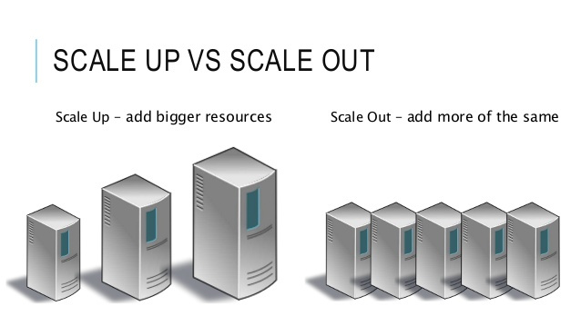
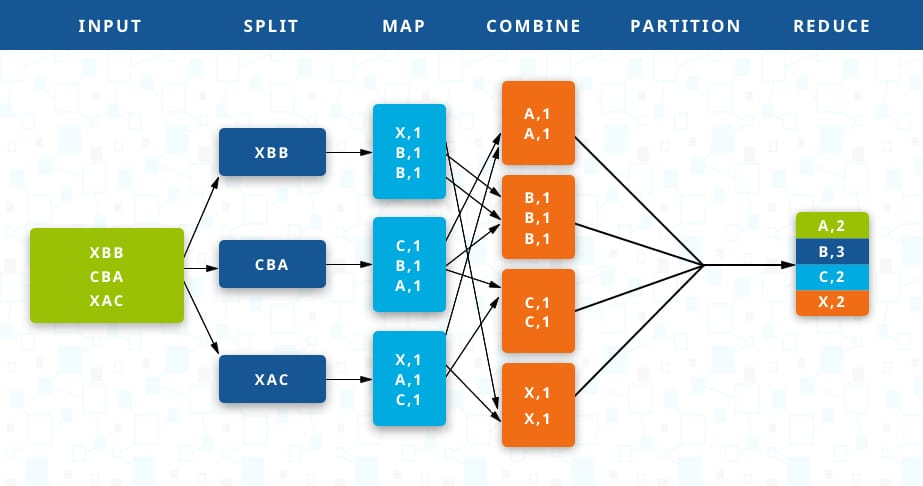

## 云计算应用与开发

### Lecture3 云计算背后的技术-2

------

Preview：

1. 目前工业界比较强的需求：面向AI的计算
2. Amazon Elastic Computing
3. 分布式存储的好处（存储与计算的结合）

------

#### 扩展性能的需求（scale-up vs scale-out）

1. Scale-up(Vertical Scaling)：现有系统中加入更多资源 e.g：更多CPU，内存，更快的网络
2. Scale-out(Horizontal Scaling)：现有系统加入更多节点 e.g：更多主机节点和存储节点

总结：Scale-up 靠增加处理器来提升运算能力，Scale-out 增加独立服务器来增加运算能力。Scale-up到上限时，就需要Scale-out来满足进一步的需求了

了解：AWS Auto Scaling

------

#### 分布式计算（Distributed Computing）

顺序结构；**分支结构**；循环结构

MapReduce（Google：用什么处理这么海量数据？Map和Reduce！）

##### MapReduce的概念：由Jeff Dean和Sanjay Ghemawat在2004年在 *MapReduce: Simplified data processing on large clusters* 中提出

##### MapReduce的起源：数据爆炸，计算非常耗时，数据处理必须依赖分布式计算并行化计算

1. 并行化计算
2. 分布式部署数据
3. 负载均衡
4. 容错机制

##### 而MapReduce将分布式计算抽象化，隐藏上述实现细节

1. Map Function：将原始数据转化为key/value pair
2. Reduce Function：根据key聚合value，得到最后的计算结果

##### MapReduce：Dataflow

1. Input reader：读入文件并划分成固定大小的存储块（split，通常64M或128M），并分配到maper节点
2. **Map：将split中的数据根据问题的需求转换为key/value pair并输出**
3. Partition：将map函数的输出结果，根据key值分配到不同的reducer节点
4. Comparison：对分配到每个reducer节点key/value pair进行排序
5. **Reduce：根据问题需求对每个key的value进行迭代计算，输出key对应的最终结果**
6. Output Writer：将reducer的输出结果写入磁盘文件系统

##### MapReduce理念：任务通过切分数据的方式，完成小任务，最后再合并

1. 可行：找海量数据中的最大值
2. Map执行时候，各个Map操作之间是不需要通讯的

##### MapReduce的应用：

1. 统计URL访问频率 map: <URL, 1>; reduce: <URL, totalCount>
2. 反向Web链接图 map: <targePage, sourcePage>; reduce: <targetPage, list (sourcePage)>
3. 倒排索引 map: <word, docID>; reduce: <word, list (docID)>

------

#### Hadoop：分布式大数据计算的开源软件集合

#### Hadoop出现后，才叫做“大数据”！

Hadoop集群的使用请见Lab

