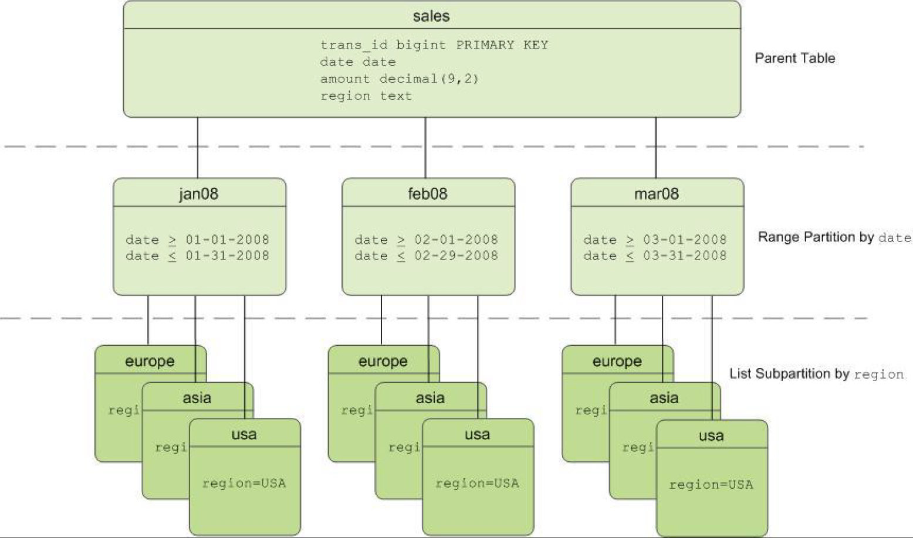

## 2020Fall 云计算应用与开发 

### Lecture3 云计算背后的技术-2 Cont'd

#### 其他分布式计算模型：MPI(Message Passing Interface 消息传递接口)

1. 需要程序员编写点对点收发消息的操作
2. 基于消息传递协议的并行编程接口
3. 比Hadoop/Spark更加灵活
4. MPI可以实现MapReduce的功能，但反之不然
5. 缺少完善的容错机制，需要手动编写

#### 为什么使用key-value存储

1. 海量非结构化的数据
2. 大量随机读写
3. 外键和join很少使用

------

内存存储vs磁盘存储？newsql

### 分布式存储（**Distributed Storage System**）：

通过网络接连将数据存储在多个计算机节点上，通常用一种复制（多副本）的方式

#### 分布式存储的类型：

1. 结构化存储（分布式数据库）：MySQL / PostgreSQL (GreenPlum)
2. 非结构化存储：HDFS (Hadoop Distributed File System) / GFS (Google File System)
3. 半结构化存储：Bigtable / Hbase / Dynamo
4. 内存存储：Redis / MonetDB
5. NewSQL：Google Spanner

#### 分布式存储的关键技术

1. 数据一致性：不同副本的数据应当保持一致
2. 数据的均匀分布：不同服务器上数据应分布均匀
3. 容错机制：自动迁移和恢复数据，不要让错误和故障对数据的影响扩散太大，最好只影响自己
4. 负载均衡：将工作量分不到多个服务器上，单台机器上不合理的工作量会拖累整个系统
5. 并发控制：分布式事务处理

#### CAP定理：C(consistence)A(availability)P(partition tolerance)

1. 分区容忍指的是网络分区
2. CAP指的是各指标之间的的tradeoff
3. CAP不可能三个同时满足

#### 数据库架构：

1. 了解Greenplum，Greenplum数据库架构相对于传统单机RDBMS可扩展性增强，可用性提高
2. 关系型数据库约束了可扩展性
3. NoSQL：Not Only SQL，非关系型数据库管理系统，通常被认为是半结构化存储，高可用易扩展，不支持复杂的查询（e.g join）
4. 数据库的强一致性：在任何时刻所有的用户或者进程查询到的都是最近一次成功更新的数据。
5. 最终一致性：在某一时刻用户或者进程查询到的数据可能会不同，但是最终成功更新的数据都会被所有用户或者进程查询到
6. 弱一致性：数据更新后，用户或者进程访问到部分或者全部访问不到最新的更新