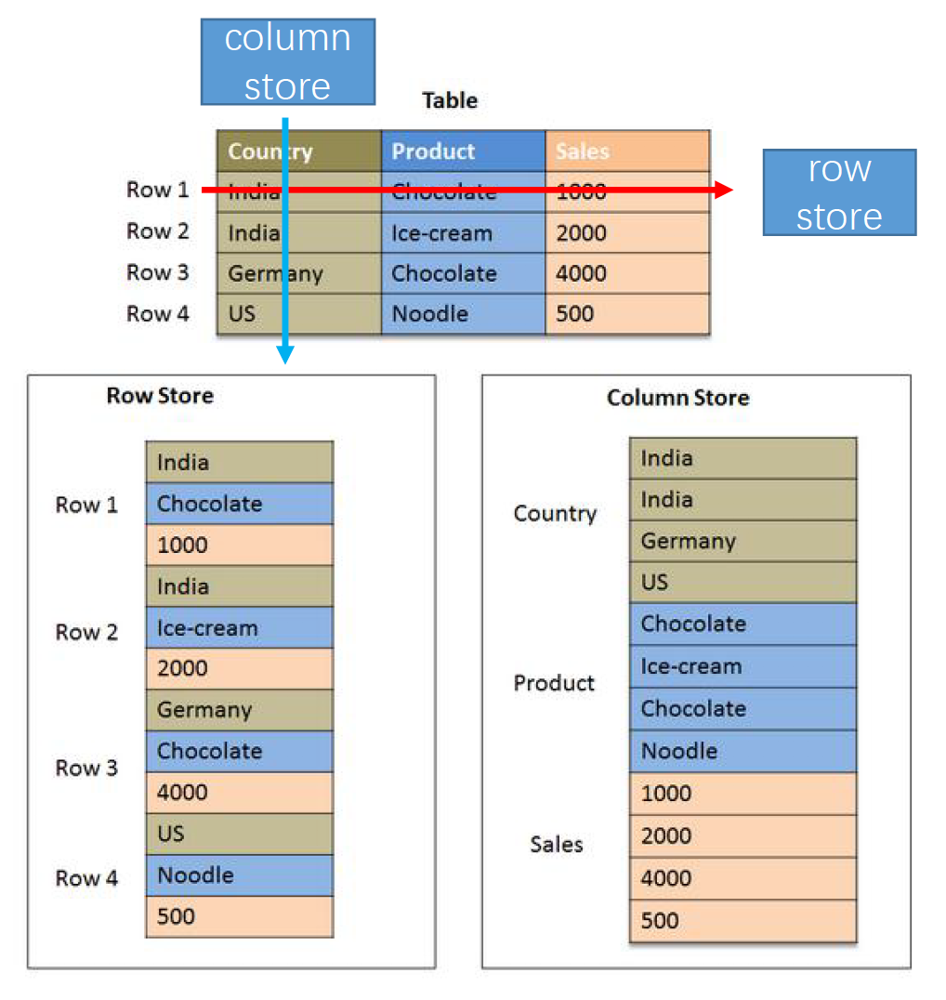
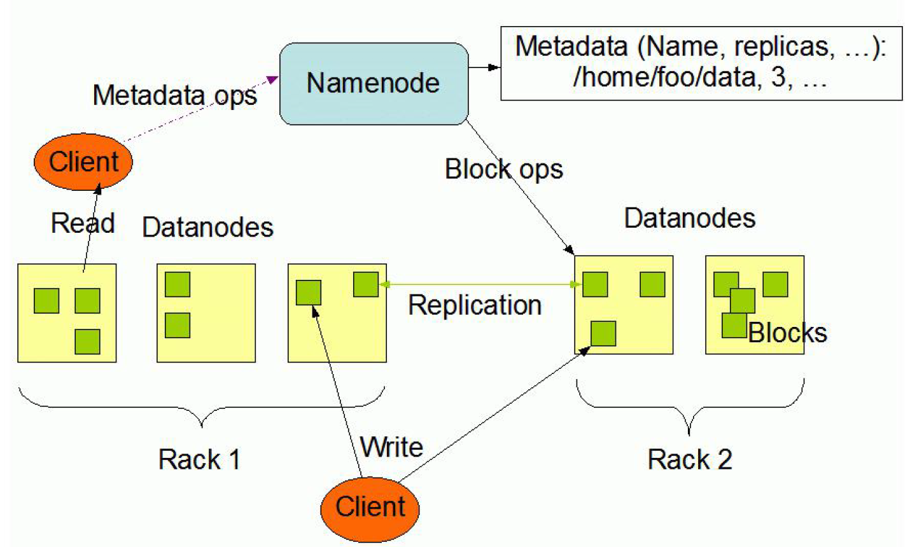

## 2020Fall 云计算应用与开发 

### Lecture4 云计算背后的技术-2 Cont'd

#### Key-Value Storage 键值存储

1. 淘宝 item number $\rightarrow$ information about the item
2. 携程 flight number $\rightarrow$ information about the flight
3. Weibo id $\rightarrow$ all posts of the ID
4. API:gt(key) and put(key,value)

Remarks: value可能是xml,json,文档...

#### 为什么要使用Key-Value Storage

1. 海量非结构化数据
2. 大量随机读写
3. foreign key和join很少使用

#### Key-Value Storage的特性

1. 非结构化存储
2. 每一行的column不同
3. 不一定要支持foreign key和join

#### 存储方式

1. row store：表中每一行存储在连续的地址空间，适合处理大量attribute和record，通常采用schema，RDBMS（关系型数据库）常使用row store
2. column store：表中每一列存储在连续的地址空间，适合少量attribute的range search，通常采用key-value形式

------

#### NoSQL所面临的挑战

1. SQL支持不足：往往不支持join等复杂查询
2. 开源：没有统一标准，系统尚不成熟
3. 功能不够丰富：通常用于随机读写非结构化数据，缺乏丰富函数的支持
4. 文件容量通常比较大：JSON，Graph

常见的云计算平台中的NoSQL服务：Google Cloud Datastore，Amazon DynamoDB，Azure Cosmos DB

#### NewSQL：SQL和NoSQl的结合

1. 关系型数据库

2. 遵循ACID原则

3. 满足NoSQL高可扩展性

Remarks:**ACID原则**是指[数据库管理系统](https://zh.wikipedia.org/wiki/数据库管理系统)（[DBMS](https://zh.wikipedia.org/wiki/DBMS)）在写入或更新资料的过程中，为保证[事务](https://zh.wikipedia.org/wiki/数据库事务)（transaction）是正确可靠的，所必须具备的四个特性：[原子性](https://zh.wikipedia.org/w/index.php?title=原子性&action=edit&redlink=1)（atomicity）、[一致性](https://zh.wikipedia.org/wiki/一致性_(数据库))（consistency）、[隔离性](https://zh.wikipedia.org/wiki/隔離性)（isolation）、[持久性](https://zh.wikipedia.org/w/index.php?title=持久性&action=edit&redlink=1)（durability）。(Source:wikipedia)

------

### Google 三件套：GFS、BigTable、MapReduce

#### HDFS/GFS非结构化存储

分布式文件管理系统：

1. 用来存储海量非结构化数据，如日志、网页、图片等
2. GFS（Hadoop Distributed File System即为GFS的开源实现）

GFS vs HDFS：https://www.slideshare.net/YuvalCarmel/gfs-vs-hdfs

#### HDFS的架构

#### HDFS 的特性$\rightarrow$ append only!

读数据占多，很少去更新已经存在的文件，新数据仅仅是写在老数据后面，顺序地进行写入

