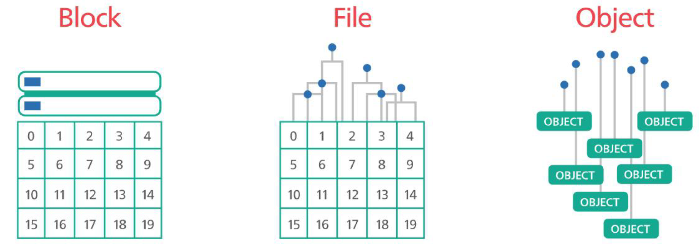
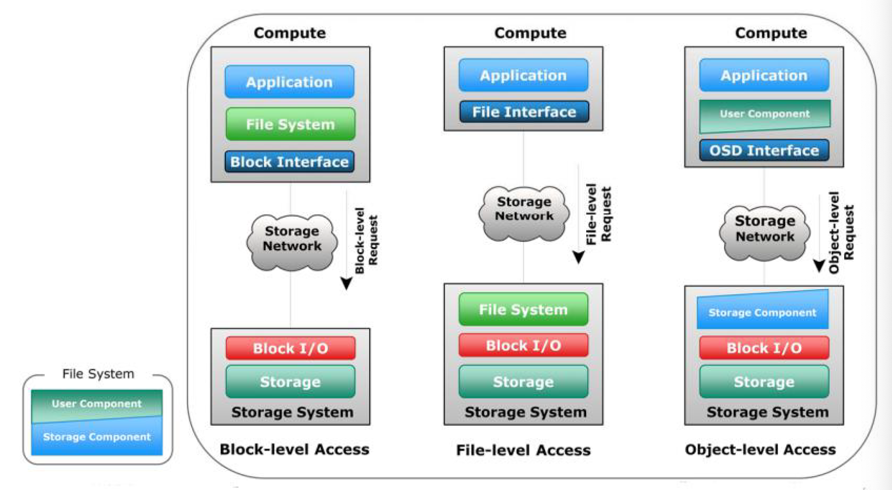

## 2020Fall 云计算应用与开发 

### Lecture7 分布式资源管理

概念：SIMD(Single Instruction Multiple Data)，采用一个控制器来控制多个处理器，同时对一组数据中的每一个分别执行相同操作实现空间上的并行

#### 分布式数据存储：数据结构的角度

1. 结构化数据存储
2. 半结构化数据存储
3. 非结构化数据存储

------

#### 分布式数据存储：数据抽象的角度

（数据如何被组织在存储设备中）

1. 块存储（Block-level Storage）
2. 文件存储（Block-level Storage）
3. 对象存储（Object-level Storage）

数据被存储在原始的磁盘卷（裸磁盘），文件被分割成固定大小的“块”，以多副本形式存储在磁盘之中。每个块被赋予唯一的ID，OS通过ID存取数据，读取文件时文件系统重新组装数据块。**数据和用户环境脱钩，可以分布在多个不同操作系统环境中，可以有多个存储路径。**

*在云环境中，数据块通过SAN(Storage Area Network)被存放在最合适的位置*

#### 块存储的特点和应用

优点：

1. 延时低，高效，高容错
2. 数据可以跨平台存储
3. 适合处理企业级海量数据

缺点：

1. 缺乏**元数据处理机制**（通常由操作系统代劳）
2. 价格昂贵，SAN引入了额外开销
3. 数据共享不便

应用：数据库，RAID，虚拟机存储系统

------

#### 文件存储的特点和应用

文件存储是传统的操作系统存储方式，依赖于特定的文件系统（如FAT32，Ext4，NTFS），不同块的数据被组织成文件，文件按照层级目录结构组织，依靠路径对文件进行定位。文件存储通常用于本地硬盘和网络附加存储（NAS，Network Attached Storage）设备

优点：

1. 层次结构简单清晰
2. 文件量不多时定位快
3. 使用NAS可以实现scale-out与多人共享

缺点：

1. scale-up困难，一般只能替换存储设备
2. 从海量文件中定位文件相对较难

应用：各类型文件的共享和存档，文件备份和灾备

------

#### 对象存储的特点和应用

对象存储用于存储海量非结构化数据，不同块中的数据连同元数据和唯一ID被打包为对象，OSD（Object Storage Device）将所有对象组织在扁平地址空间中（Flat Address Space），**即所有对象都存储在同一层级**，应用通过HTTP API（RESTful）来访问对象存储系统

优点：

1. 可以包含非常丰富的元数据
2. 适合分布式存储，可扩展性高（无参差结构）
3. 通过调用API访问，支持Pay-as-you-go

缺点：

1. 读写效率相较块存储和文件存储低
2. 对象不易修改，不支持频繁修改，如事务处理

应用：非结构化数据存储，数据分析，网页应用，备份存档

------

下图为三种存储方式的总结

#### 

#### 三种存储方式在云计算中的典型产品

1. 块存储：Amazon Elastic Block Storage (EBS), Google Persistens Disks

2. 文件存储：Amazon Elastic File System (EFS), Azure File
3. 对象存储：Amazon Simple Storage Service (S3), Google Cloud Storage, Azure BLOB Storage

**BLOB: 二进制大型对象**（英语：binary large object ，或英语：basic large object，缩写为Blob、BLOB、BLOb），在DBMS中，将二进制资料存储为一个单一个体的集合。Blob通常是影像、声音或多媒体文件。(source: wikipedia)

